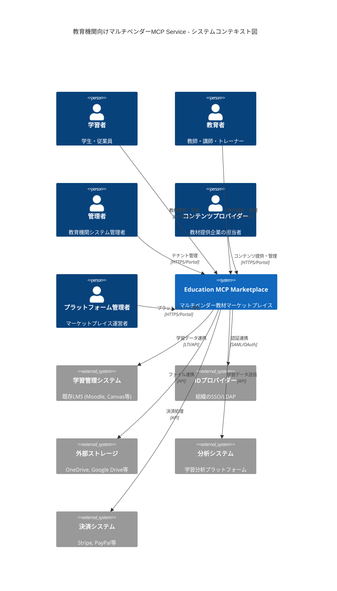
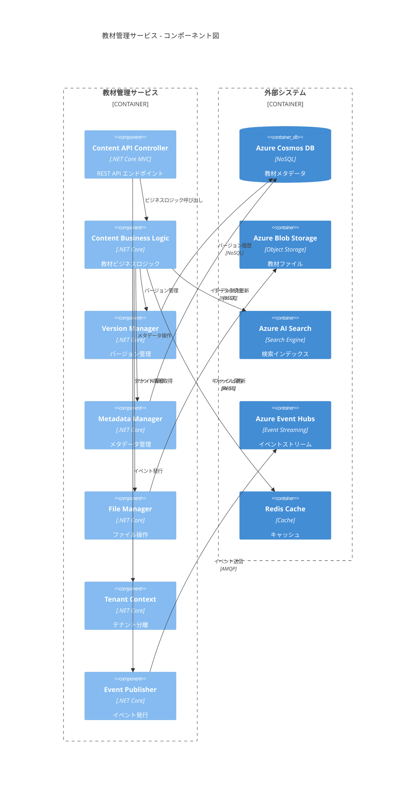
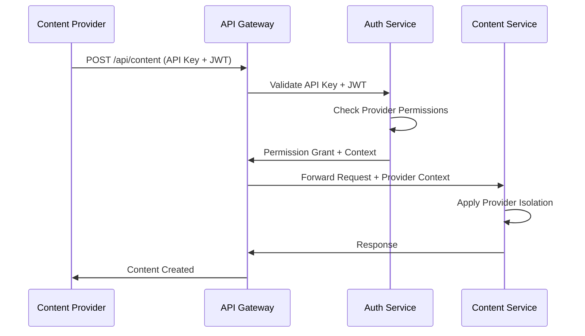
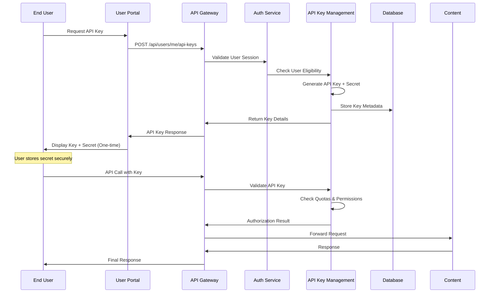

# 教育機関向けマルチテナント型MCP Service アーキテクチャ設計書

**作成日**: 2025年10月19日  
**プロジェクト**: Education Multi-tenant MCP Service  
**対象**: 全教育機関（K-12〜企業研修）  

## 1. エグゼクティブサマリー

### 1.1 プロジェクト概要
教育機関向けの大規模マルチテナント・マルチベンダー型Model Context Protocol (MCP) Serviceを開発します。このシステムは、複数のコンテンツプロバイダー企業が教材を提供し、1,000以上の教育機関テナントに対し、100,000以上のユーザーが同時利用可能な**教材マーケットプレイス**プラットフォームです。

### 1.2 主要な設計決定
- **クラウドプラットフォーム**: Microsoft Azure
- **アーキテクチャパターン**: マイクロサービス + イベント駆動アーキテクチャ
- **テナント分離戦略**: マルチテナント（教育機関）+ マルチベンダー（コンテンツプロバイダー）
- **ビジネスモデル**: B2B2C マーケットプレイス型
- **認証**: Azure AD B2C + API Key + JWT
- **コンプライアンス**: GDPR, COPPA, FERPA, SOC 2 Type II 準拠

### 1.3 期待される成果
- 99.9% 可用性保証
- レスポンス時間 p95 < 200ms
- エンタープライズセキュリティ準拠
- 自動スケーリング対応

## 2. ビジネスドライバーと制約

### 2.1 ビジネスドライバー
- **グローバル教育市場の拡大**: K-12から企業研修まで全領域対応
- **マルチベンダーエコシステム**: 複数コンテンツプロバイダー企業の参加
- **デジタル教材の多様化**: テキスト、動画、インタラクティブコンテンツ統合
- **個人化学習の需要**: 学習進捗追跡と分析機能
- **コンプライアンス要求**: 多地域・多規制への対応
- **収益分配モデル**: プロバイダー・プラットフォーム間の透明な課金
- **エンドユーザーAPI需要**: 学習者・教育者による直接API利用

### 2.2 技術的制約
- Azure プラットフォーム限定
- Model Context Protocol 仕様準拠
- 既存LMSとの連携必須
- レガシーシステム統合対応

### 2.3 組織的制約
- セキュリティファースト開発
- 段階的ロールアウト戦略
- 24/7 サポート体制

## 3. アーキテクチャビジョン

### 3.1 設計原則
1. **セキュリティファースト**: 多層防御とゼロトラスト設計
2. **スケーラビリティ**: 水平スケーリング優先
3. **可観測性**: 包括的モニタリングとログ記録
4. **レジリエンス**: 自動復旧と障害隔離
5. **コンプライアンス**: プライバシーバイデザイン

### 3.2 品質属性優先度
1. **セキュリティ** (最優先)
2. **可用性** (99.9%)
3. **パフォーマンス** (p95 < 200ms)
4. **スケーラビリティ** (100,000+ ユーザー)
5. **保守性** (マイクロサービス)

### 3.3 アーキテクチャパターン
- **マイクロサービスアーキテクチャ**: 独立デプロイ・スケーリング
- **イベント駆動アーキテクチャ**: 非同期処理・疎結合
- **CQRS + Event Sourcing**: 読み書き分離・監査証跡
- **Multi-tenant SaaS**: テナント分離・リソース共有最適化

## 4. C4モデル

### 4.1 Context図 (Level 1)


```

### 4.2 Container図 (Level 2)

```mermaid
C4Container
    title 教育機関向けマルチベンダーMCP Service - コンテナ図

    Person(users, "ユーザー", "学習者・教育者・管理者")
    Person(providers, "コンテンツプロバイダー", "教材提供企業")
    
    Container_Boundary(web, "Web 層") {
        Container(webapp, "Web Application", "React/TypeScript", "ユーザー向けWebアプリ")
        Container(portal, "Admin Portal", "React/TypeScript", "教育機関管理者ポータル")
        Container(provider_portal, "Provider Portal", "React/TypeScript", "コンテンツプロバイダーポータル")
    }
    
    Container_Boundary(gateway, "API Gateway 層") {
        Container(apigateway, "API Gateway", "Azure API Management", "API統合・認証・流量制御")
    }
    
    Container_Boundary(services, "マイクロサービス層") {
        Container(auth, "認証サービス", ".NET Core", "ユーザー認証・認可")
        Container(apikey, "APIキー管理", ".NET Core", "エンドユーザーAPIキー発行・管理")
        Container(tenant, "テナント管理", ".NET Core", "教育機関管理")
        Container(provider, "プロバイダー管理", ".NET Core", "コンテンツプロバイダー管理")
        Container(content, "教材管理", ".NET Core", "教材CRUD・メタデータ")
        Container(catalog, "カタログサービス", ".NET Core", "教材カタログ・検索")
        Container(licensing, "ライセンス管理", ".NET Core", "利用権限・課金管理")
        Container(progress, "進捗管理", ".NET Core", "学習進捗追跡")
        Container(notification, "通知サービス", ".NET Core", "イベント通知")
        Container(analytics, "分析サービス", ".NET Core", "利用分析・レポート")
        Container(apikey_mgmt, "APIキー管理", ".NET Core", "エンドユーザーAPIキー発行・管理")
    }
    
    Container_Boundary(data, "データ層") {
        ContainerDb(sqldb, "Azure SQL Database", "SQL Server", "メタデータ・設定・課金")
        ContainerDb(cosmosdb, "Azure Cosmos DB", "NoSQL", "教材・進捗・ログ")
        ContainerDb(redis, "Azure Cache for Redis", "Redis", "セッション・キャッシュ")
        Container(blob, "Azure Blob Storage", "Object Storage", "教材ファイル")
        Container(search_idx, "Azure AI Search", "Search Engine", "全文検索インデックス")
    }
    
    Container_Boundary(messaging, "メッセージング") {
        Container(eventhub, "Azure Event Hubs", "Event Streaming", "イベントストリーミング")
        Container(servicebus, "Azure Service Bus", "Message Queue", "非同期メッセージ")
    }

    Rel(users, webapp, "利用", "HTTPS")
    Rel(users, portal, "管理", "HTTPS")
    Rel(providers, provider_portal, "コンテンツ管理", "HTTPS")
    
    Rel(webapp, apigateway, "API呼び出し", "HTTPS/REST")
    Rel(portal, apigateway, "API呼び出し", "HTTPS/REST")
    Rel(provider_portal, apigateway, "API呼び出し", "HTTPS/REST")
    
    Rel(apigateway, auth, "認証", "HTTPS/REST")
    Rel(apigateway, tenant, "テナント管理", "HTTPS/REST")
    Rel(apigateway, provider, "プロバイダー管理", "HTTPS/REST")
    Rel(apigateway, content, "教材管理", "HTTPS/REST")
    Rel(apigateway, catalog, "カタログ検索", "HTTPS/REST")
    Rel(apigateway, licensing, "ライセンス管理", "HTTPS/REST")
    Rel(apigateway, progress, "進捗管理", "HTTPS/REST")
    Rel(apigateway, analytics, "分析", "HTTPS/REST")
    Rel(apigateway, apikey_mgmt, "APIキー管理", "HTTPS/REST")
    
    Rel(auth, sqldb, "ユーザー情報", "SQL")
    Rel(tenant, sqldb, "テナント情報", "SQL")
    Rel(provider, sqldb, "プロバイダー情報", "SQL")
    Rel(apikey_mgmt, sqldb, "APIキー情報", "SQL")
    Rel(content, cosmosdb, "教材データ", "NoSQL")
    Rel(content, blob, "ファイル", "REST")
    Rel(catalog, search_idx, "検索クエリ", "REST")
    Rel(licensing, sqldb, "ライセンス情報", "SQL")
    Rel(progress, cosmosdb, "進捗データ", "NoSQL")
    Rel(analytics, cosmosdb, "分析データ", "NoSQL")
    
    Rel(content, eventhub, "教材イベント", "AMQP")
    Rel(licensing, eventhub, "ライセンスイベント", "AMQP")
    Rel(progress, eventhub, "進捗イベント", "AMQP")
    Rel(notification, servicebus, "通知キュー", "AMQP")
    
    Rel_Back(redis, auth, "セッション管理", "Redis Protocol")
    Rel_Back(redis, catalog, "検索キャッシュ", "Redis Protocol")
```


```

### 4.3 Component図 - 教材管理サービス (Level 3)



## 5. セキュリティアーキテクチャ

### 5.1 ゼロトラストセキュリティモデル

#### 5.1.1 認証・認可戦略
```
┌─────────────────┐    ┌──────────────────┐    ┌─────────────────┐
│   クライアント   │───▶│  Azure AD B2C    │───▶│  API Gateway    │
│                │    │  + API Key       │    │  (APIM)        │
└─────────────────┘    └──────────────────┘    └─────────────────┘
                                ▼                        ▼
                       ┌──────────────────┐    ┌─────────────────┐
                       │  JWT Validation  │    │ Microservices   │
                       │  + Claims        │    │ (Service-to-    │
                       └──────────────────┘    │  Service Auth)  │
                                               └─────────────────┘
```

#### 5.1.2 多層防御実装
1. **ネットワークセキュリティ**
   - Azure Virtual Network 分離
   - Network Security Groups (NSG)
   - Azure Firewall + WAF

2. **アプリケーションセキュリティ**
   - API Management での流量制御・認証
   - Azure Key Vault での秘密情報管理
   - Managed Identity での認証

3. **データセキュリティ**
   - データ暗号化 (保存時・転送時)
   - Row Level Security (RLS)
   - Transparent Data Encryption (TDE)

### 5.2 コンプライアンス設計

#### 5.2.1 GDPR対応
- **データ最小化**: 必要最小限のデータ収集
- **同意管理**: 明示的同意とオプトアウト
- **データポータビリティ**: データエクスポート機能
- **削除権**: 完全データ削除 (Event Sourcing考慮)

#### 5.2.2 COPPA対応 (13歳未満)
- **保護者同意**: 年齢確認と保護者認証
- **データ制限**: 最小限の個人情報収集
- **第三者共有制限**: 教育目的以外での共有禁止

#### 5.2.3 FERPA対応 (教育記録)
- **アクセス制御**: 教育関係者のみアクセス
- **監査ログ**: 全アクセス記録
- **データ分類**: 教育記録の明確な分類

## 6. 可観測性戦略

### 6.1 SLI/SLO定義

| SLI | SLO | 測定方法 |
|-----|-----|----------|
| 可用性 | 99.9% | Azure Monitor 死活監視 |
| レスポンス時間 | p95 < 200ms | Application Insights |
| エラー率 | < 0.1% | ログ分析 |
| スループット | > 1000 req/s | メトリクス監視 |

### 6.2 監視・ログ戦略

#### 6.2.1 三つの柱
1. **メトリクス**: Azure Monitor + Prometheus
2. **ログ**: Azure Log Analytics + Structured Logging
3. **トレーシング**: Application Insights + OpenTelemetry

#### 6.2.2 アラート設定
```yaml
アラート階層:
  Critical:
    - サービス停止 (即座にページング)
    - セキュリティインシデント
  Warning:
    - パフォーマンス劣化
    - リソース使用率高騰
  Info:
    - デプロイ完了
    - スケーリングイベント
```

## 7. スケーラビリティ & レジリエンス

### 7.1 スケーリング戦略

#### 7.1.1 水平スケーリング
- **Azure Container Apps**: 自動スケーリング (0-100インスタンス)
- **Azure SQL Database**: エラスティックプール
- **Azure Cosmos DB**: パーティション戦略
- **Azure Cache for Redis**: クラスタリング

#### 7.1.2 容量計画
```
想定負荷:
- 同時接続ユーザー: 10,000人
- API呼び出し: 10,000 req/s
- データストレージ: 100TB (年間成長率50%)
- ネットワーク帯域: 10Gbps
```

### 7.2 レジリエンスパターン

#### 7.2.1 Circuit Breaker
```csharp
// Polly使用例
builder.Services.AddHttpClient<ContentService>()
    .AddPolicyHandler(GetRetryPolicy())
    .AddPolicyHandler(GetCircuitBreakerPolicy());
```

#### 7.2.2 Bulkhead分離
- テナント別リソース分離
- サービス別リソース割り当て
- 優先度別処理キュー

### 7.3 災害復旧 (DR)

#### 7.3.1 RPO/RTO目標
- **RPO**: 15分 (データ損失許容時間)
- **RTO**: 4時間 (復旧時間目標)

#### 7.3.2 バックアップ戦略
- Azure SQL Database: Geo-redundant backup
- Cosmos DB: Continuous backup
- Blob Storage: Cross-region replication

## 8. マルチベンダー・マルチテナント設計

### 8.1 階層構造設計

#### 8.1.1 ステークホルダー階層
```
Platform Level (プラットフォーム)
├── Platform Admins (運営者)
└── System Components (システム)

Provider Level (コンテンツプロバイダー)
├── Provider Admins (プロバイダー管理者)
├── Content Creators (コンテンツ作成者)
└── Content Library (プロバイダー所有コンテンツ)

Tenant Level (教育機関)
├── Tenant Admins (機関管理者)
├── Educators (教育者)
├── Students (学習者)
└── Licensed Content (ライセンス済みコンテンツ)
```

#### 8.1.2 データ分離戦略
```
Level 1: プロバイダー分離
├── 完全なデータ分離 (コンテンツプロバイダー間)
├── 専用ストレージパーティション
├── 独立課金・分析
└── プロバイダー固有メタデータ

Level 2: テナント分離 (従来)
├── 教育機関別論理分離
├── アクセス制御・権限管理
├── カスタマイゼーション
└── 使用量・課金管理

Level 3: ユーザー分離
├── 個人別進捗・履歴
├── プライバシー保護
├── 個人化設定
└── コンプライアンス対応
```

### 8.2 コンテンツプロバイダー管理

#### 8.2.1 プロバイダー情報モデル
```json
{
  "providerId": "provider-001",
  "companyName": "ABC Educational Inc.",
  "providerType": "ENTERPRISE|INDIVIDUAL|INSTITUTION",
  "status": "ACTIVE|PENDING|SUSPENDED",
  "onboardingDate": "2025-01-15T00:00:00Z",
  "businessModel": {
    "revenueShare": 70.0,
    "pricingModel": "SUBSCRIPTION|PER_USAGE|FREEMIUM",
    "paymentSchedule": "MONTHLY|QUARTERLY"
  },
  "contentCategories": [
    "STEM", "LANGUAGE", "PROFESSIONAL_DEVELOPMENT"
  ],
  "targetAudience": [
    "K12", "HIGHER_ED", "CORPORATE"
  ],
  "compliance": {
    "certifications": ["SOC2", "GDPR_COMPLIANT"],
    "dataResidency": ["US", "EU"],
    "contentModeration": true
  },
  "apiAccess": {
    "rateLimits": {
      "uploadsPerDay": 1000,
      "apiCallsPerHour": 10000
    },
    "allowedOperations": [
      "CREATE_CONTENT", "UPDATE_CONTENT", "VIEW_ANALYTICS"
    ]
  }
}
```

#### 8.2.2 コンテンツライセンス管理
```json
{
  "licenseId": "lic-001-abc-math",
  "contentId": "content-001",
  "providerId": "provider-001", 
  "tenantId": "tenant-001",
  "licenseType": "SUBSCRIPTION|PERPETUAL|TRIAL",
  "pricing": {
    "model": "PER_USER|PER_INSTITUTION|UNLIMITED",
    "amount": 9.99,
    "currency": "USD",
    "billingCycle": "MONTHLY"
  },
  "usage": {
    "maxUsers": 500,
    "maxDownloads": 1000,
    "allowOffline": true,
    "allowPrint": false,
    "allowShare": true
  },
  "validity": {
    "startDate": "2025-01-01T00:00:00Z",
    "endDate": "2025-12-31T23:59:59Z",
    "autoRenew": true
  },
  "restrictions": {
    "geographicalRestrictions": ["US", "CA"],
    "institutionTypes": ["K12", "UNIVERSITY"],
    "usageReporting": true
  }
}
```

### 8.3 マーケットプレイス機能

#### 8.3.1 コンテンツカタログ
- **統合検索**: 全プロバイダーコンテンツの横断検索
- **フィルタリング**: プロバイダー、価格、ライセンス、評価
- **レコメンデーション**: AI推奨エンジン
- **プレビュー機能**: 購入前の試用・サンプル視聴

#### 8.3.2 収益分配システム
```python
# 収益分配計算例
def calculate_revenue_share(usage_data, license_info, provider_info):
    base_revenue = usage_data.total_revenue
    platform_fee = base_revenue * 0.15  # プラットフォーム手数料15%
    provider_share = base_revenue * (provider_info.revenue_share / 100)
    
    # ボリュームディスカウント
    if usage_data.monthly_users > 10000:
        provider_bonus = base_revenue * 0.05
        provider_share += provider_bonus
    
    return {
        "platform_fee": platform_fee,
        "provider_share": provider_share,
        "net_revenue": base_revenue - platform_fee
    }
```

### 8.4 アクセス制御・権限管理

#### 8.4.1 Role-Based Access Control (RBAC)
```yaml
Roles:
  Platform:
    - platform.admin (全権限)
    - platform.support (サポート権限)
    - platform.analytics (分析権限)
  
  Provider:
    - provider.admin (プロバイダー管理)
    - provider.creator (コンテンツ作成)
    - provider.analyst (分析閲覧)
  
  Tenant:
    - tenant.admin (テナント管理)
    - tenant.educator (教育者権限)
    - tenant.student (学習者権限)

Permissions:
  Content:
    - content.create
    - content.read
    - content.update
    - content.delete
    - content.publish
  
  Analytics:
    - analytics.view.own
    - analytics.view.tenant
    - analytics.view.platform
  
  Billing:
    - billing.view
    - billing.manage
```

#### 8.4.2 API認証フロー


### 8.6 エンドユーザーAPIキー管理

#### 8.6.1 APIキー階層設計
```
Platform Level API Keys
├── Global Admin Access
├── Cross-Provider Operations  
└── Platform Analytics

Provider Level API Keys
├── Provider Content Management
├── Provider Analytics
└── Provider User Management

Tenant Level API Keys
├── Tenant Administration
├── Tenant Content Access
└── Tenant User Management

End User Level API Keys (新規)
├── Personal Content Access
├── Learning Progress Management
├── Individual Analytics
└── Third-party Integration
```

#### 8.6.2 エンドユーザーAPIキー仕様
```json
{
  "apiKeyId": "user-key-001",
  "userId": "user-12345",
  "tenantId": "tenant-001",
  "keyType": "END_USER",
  "keyName": "My Learning API",
  "description": "Personal learning app integration",
  "permissions": [
    "content.read.personal",
    "progress.read.personal", 
    "progress.write.personal",
    "analytics.read.personal"
  ],
  "quotas": {
    "dailyRequests": 10000,
    "monthlyRequests": 300000,
    "rateLimitPerMinute": 100,
    "storageQuotaMB": 100
  },
  "restrictions": {
    "ipWhitelist": ["203.0.113.0/24"],
    "allowedDomains": ["mylearningapp.com"],
    "timeRestrictions": {
      "allowedHours": "06:00-22:00",
      "timezone": "UTC"
    }
  },
  "security": {
    "encryptionLevel": "AES256",
    "keyRotationDays": 90,
    "mfaRequired": false,
    "auditLogging": true
  },
  "metadata": {
    "createdAt": "2025-10-19T10:00:00Z",
    "lastUsed": "2025-10-19T14:30:00Z",
    "status": "ACTIVE|SUSPENDED|REVOKED",
    "expiryDate": "2026-10-19T10:00:00Z"
  }
}
```

#### 8.6.3 APIキー権限マトリックス
```yaml
EndUser_Permissions:
  Content:
    - content.read.personal      # 個人がアクセス可能なコンテンツ閲覧
    - content.bookmark.manage    # ブックマーク管理
    - content.note.manage        # 個人メモ管理
    - content.download.personal  # 個人利用ダウンロード
  
  Progress:
    - progress.read.personal     # 個人学習進捗閲覧
    - progress.write.personal    # 学習進捗更新
    - progress.export.personal   # 進捗データエクスポート
  
  Analytics:
    - analytics.read.personal    # 個人学習分析閲覧
    - analytics.dashboard.personal # 個人ダッシュボード
  
  Social:
    - social.share.content       # コンテンツ共有
    - social.group.participate   # 学習グループ参加
    - social.discussion.read     # ディスカッション閲覧
    - social.discussion.write    # ディスカッション投稿

Restricted_Operations:
  - tenant.admin.*            # テナント管理操作
  - content.create.*          # コンテンツ作成
  - content.delete.*          # コンテンツ削除  
  - user.manage.*             # 他ユーザー管理
  - billing.*                 # 課金関連操作
```

#### 8.6.4 APIキー発行フロー


#### 8.6.5 使用量追跡・分析
```sql
-- APIキー使用量テーブル
CREATE TABLE ApiKeyUsage (
    UsageId UNIQUEIDENTIFIER PRIMARY KEY DEFAULT NEWID(),
    ApiKeyId UNIQUEIDENTIFIER NOT NULL,
    UserId UNIQUEIDENTIFIER NOT NULL,
    TenantId UNIQUEIDENTIFIER NOT NULL,
    Endpoint NVARCHAR(200) NOT NULL,
    HttpMethod NVARCHAR(10) NOT NULL,
    StatusCode INT NOT NULL,
    ResponseTimeMs INT NOT NULL,
    RequestSize BIGINT NOT NULL,
    ResponseSize BIGINT NOT NULL,
    Timestamp DATETIME2 NOT NULL,
    ClientIP NVARCHAR(45),
    UserAgent NVARCHAR(500),
    
    INDEX IX_ApiKeyUsage_ApiKeyId_Timestamp 
        (ApiKeyId, Timestamp DESC),
    INDEX IX_ApiKeyUsage_UserId_Timestamp 
        (UserId, Timestamp DESC)
);

-- 使用量集計ビュー
CREATE VIEW UserApiUsageSummary AS
SELECT 
    ak.UserId,
    ak.ApiKeyId,
    ak.KeyName,
    COUNT(*) as TotalRequests,
    SUM(CASE WHEN au.StatusCode < 400 THEN 1 ELSE 0 END) as SuccessfulRequests,
    AVG(au.ResponseTimeMs) as AvgResponseTime,
    SUM(au.RequestSize + au.ResponseSize) as TotalDataTransfer,
    MAX(au.Timestamp) as LastUsed
FROM ApiKeys ak
LEFT JOIN ApiKeyUsage au ON ak.ApiKeyId = au.ApiKeyId
WHERE ak.KeyType = 'END_USER'
    AND au.Timestamp >= DATEADD(day, -30, GETDATE())
GROUP BY ak.UserId, ak.ApiKeyId, ak.KeyName;
```

#### 8.6.6 セキュリティ対策
```python
# APIキー検証・レート制限実装例
from dataclasses import dataclass
from datetime import datetime, timedelta
from typing import Dict, List, Optional
import redis

@dataclass
class ApiKeyValidationResult:
    is_valid: bool
    user_id: Optional[str]
    permissions: List[str]
    quota_remaining: int
    error_message: Optional[str]

class EndUserApiKeyValidator:
    def __init__(self, redis_client: redis.Redis):
        self.redis = redis_client
    
    async def validate_api_key(
        self, 
        api_key: str, 
        endpoint: str,
        client_ip: str
    ) -> ApiKeyValidationResult:
        
        # 1. APIキー形式検証
        if not self._is_valid_key_format(api_key):
            return ApiKeyValidationResult(
                is_valid=False,
                error_message="Invalid API key format"
            )
        
        # 2. キー存在確認・メタデータ取得
        key_data = await self._get_key_metadata(api_key)
        if not key_data:
            return ApiKeyValidationResult(
                is_valid=False, 
                error_message="API key not found"
            )
        
        # 3. キー状態確認
        if key_data['status'] != 'ACTIVE':
            return ApiKeyValidationResult(
                is_valid=False,
                error_message=f"API key is {key_data['status']}"
            )
        
        # 4. 有効期限確認
        if datetime.now() > key_data['expiry_date']:
            return ApiKeyValidationResult(
                is_valid=False,
                error_message="API key expired"
            )
        
        # 5. IP制限確認
        if not self._check_ip_whitelist(client_ip, key_data['ip_whitelist']):
            return ApiKeyValidationResult(
                is_valid=False,
                error_message="IP address not allowed"
            )
        
        # 6. エンドポイント権限確認
        if not self._check_endpoint_permission(endpoint, key_data['permissions']):
            return ApiKeyValidationResult(
                is_valid=False,
                error_message="Insufficient permissions"
            )
        
        # 7. レート制限確認
        quota_check = await self._check_rate_limits(api_key, key_data['quotas'])
        if not quota_check['allowed']:
            return ApiKeyValidationResult(
                is_valid=False,
                error_message="Rate limit exceeded"
            )
        
        # 8. 使用量記録
        await self._record_usage(api_key, endpoint, client_ip)
        
        return ApiKeyValidationResult(
            is_valid=True,
            user_id=key_data['user_id'],
            permissions=key_data['permissions'],
            quota_remaining=quota_check['remaining']
        )
```

## 9. ADR (Architecture Decision Records)

### ADR-001: マイクロサービスアーキテクチャ採用

**ステータス**: 承認済み  
**決定日**: 2025-10-19  

**背景**: 
- 1,000+テナント、100,000+ユーザーの大規模システム
- 独立したスケーリングとデプロイが必要
- チーム間の並行開発を可能にする

**決定**:
マイクロサービスアーキテクチャを採用し、以下のサービスに分割：
- 認証・認可サービス
- テナント管理サービス  
- 教材管理サービス
- 検索サービス
- 進捗管理サービス
- 通知サービス

**結果**:
- 独立デプロイ・スケーリング可能
- 技術スタック選択の柔軟性
- 運用複雑性の増加

### ADR-002: Azure Cosmos DB + SQL Database ハイブリッド

**ステータス**: 承認済み  
**決定日**: 2025-10-19  

**背景**:
- 教材データは大量かつ非構造化
- メタデータは構造化され、ACID特性が必要
- グローバル分散とパフォーマンスが重要

**決定**:
- **Azure Cosmos DB**: 教材コンテンツ、学習進捗データ
- **Azure SQL Database**: ユーザー情報、テナント設定、メタデータ

**結果**:
- 適材適所のデータストア活用
- パフォーマンス最適化
- データ一貫性管理の複雑化

### ADR-003: Event-Driven Architecture with CQRS

**ステータス**: 承認済み  
**決定日**: 2025-10-19  

**背景**:
- 読み取り・書き込みパターンの最適化が必要
- 監査ログとコンプライアンス要件
- サービス間の疎結合が重要

**決定**:
- CQRS パターンで読み書き分離
- Event Sourcing で変更履歴管理
- Azure Event Hubs でイベントストリーミング

**結果**:
- 読み取りパフォーマンス向上
- 完全な監査証跡
- システム複雑性の増加

### ADR-005: エンドユーザーAPIキー管理システム

**ステータス**: 承認済み  
**決定日**: 2025-10-19  

**背景**:
- 学習者・教育者が個人的にAPIを利用したい要求の増加
- サードパーティアプリケーション連携の需要
- 個人学習データの外部活用ニーズ
- 細かな権限制御とセキュリティが必要

**決定**:
エンドユーザー向けAPIキー発行・管理システムを追加：
- **4階層APIキー設計**: Platform → Provider → Tenant → EndUser
- **細分化権限管理**: 個人データのみアクセス可能
- **使用量制限**: ユーザーレベルでのクォータ管理
- **セキュリティ強化**: IP制限、時間制限、自動ローテーション
- **専用管理UI**: ユーザーポータルでの簡単管理

**技術的実装**:
- APIキー管理マイクロサービス新設
- 細分化された権限マトリックス
- Redis ベースのレート制限
- 包括的な使用量追跡・分析
- 自動セキュリティ監視

**結果**:
- エンドユーザーのAPI活用促進
- 個人データの安全な外部連携
- プラットフォームエコシステム拡大
- セキュリティ管理の複雑化
- 運用・監視負荷の増加

## 10. 実装ロードマップ

### フェーズ1: 基盤構築（2-3か月）
- [ ] Azureインフラ構築
- [ ] 基本認証・認可システム
- [ ] **プロバイダー管理システム**（新規）
- [ ] **APIキー管理システム**（新規）
- [ ] 基本テナント管理
- [ ] 教材CRUD API（MVP）
- [ ] **ライセンス管理基盤**（新規）

### フェーズ2: コア機能（3-4か月）  
- [ ] **プロバイダーポータル**（新規）
- [ ] **エンドユーザーAPIキー管理UI**（新規）
- [ ] **マーケットプレイス機能**（新規）
- [ ] 検索機能実装
- [ ] ファイル管理システム
- [ ] バージョン管理機能
- [ ] 基本進捗追跡
- [ ] **収益分配システム**（新規）

### フェーズ3: 高度機能（4-5か月）
- [ ] **高度なライセンス管理**（新規）
- [ ] **コンテンツレコメンデーション**（新規）
- [ ] LMS連携機能
- [ ] 高度な分析機能
- [ ] リアルタイム通知
- [ ] モバイルアプリ対応

### フェーズ4: エンタープライズ（2-3か月）
- [ ] **プロバイダー間分析・比較**（新規）
- [ ] **マルチベンダー課金・請求**（新規）
- [ ] 高度なセキュリティ機能
- [ ] コンプライアンス機能完成
- [ ] パフォーマンス最適化
- [ ] 運用監視完成

## 11. 技術スタック詳細

### 11.1 フロントエンド
- **Framework**: React 18 + TypeScript
- **UI Library**: Material-UI v5
- **State Management**: Redux Toolkit + RTK Query
- **Testing**: Jest + React Testing Library

### 11.2 バックエンド
- **Framework**: .NET 8 + ASP.NET Core
- **ORM**: Entity Framework Core
- **API**: REST + GraphQL (Relay)
- **Authentication**: IdentityServer + Azure AD B2C

### 11.3 インフラストラクチャ
- **Container**: Azure Container Apps
- **Database**: Azure SQL Database + Cosmos DB
- **Cache**: Azure Cache for Redis
- **Storage**: Azure Blob Storage + CDN
- **Search**: Azure AI Search
- **Messaging**: Azure Event Hubs + Service Bus

### 11.4 DevOps
- **CI/CD**: Azure DevOps + GitHub Actions
- **Infrastructure**: Bicep + Terraform
- **Monitoring**: Azure Monitor + Application Insights
- **Security**: Azure Security Center + Key Vault

---

**文書バージョン**: 1.0  
**最終更新**: 2025年10月19日  
**次回レビュー**: 2025年11月19日

## 📚 関連ドキュメント

- **[コンテンツプロバイダー企業ユースケース](../usecases/content-provider-usecases.md)**: 詳細なプロバイダー企業向けユースケース・ペルソナ・成功事例
- **[利用者ユースケース](../usecases/end-user-usecases.md)**: 学習者・教育者・管理者向けユースケース・APIキー管理・活用シナリオ