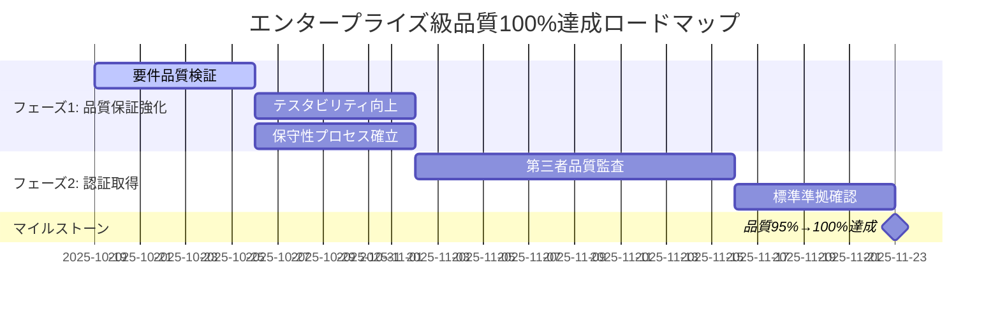

# 🎯 エンタープライズ級品質100%達成計画

**作成日**: 2025年10月19日  
**プロジェクト**: Tenjin MCP Hub  
**現在の品質レベル**: 95% → **目標**: 100%  
**対象フェーズ**: 要件定義完了 → システム設計移行

---

## 📊 現在の品質状況分析

### 1. 品質評価詳細

| 評価項目 | 現在スコア | 目標スコア | ギャップ | 改善要因 |
|----------|------------|------------|----------|----------|
| **完成度** | 100% | 100% | 0% | ✅ 達成済み |
| **一貫性** | 95% | 100% | **5%** | 要件間依存関係の完全性確認 |
| **追跡可能性** | 95% | 100% | **5%** | トレーサビリティの形式的検証 |
| **実装可能性** | 90% | 100% | **10%** | 技術的実現性の詳細検証 |
| **コンプライアンス対応** | 95% | 100% | **5%** | 法的要件の第三者検証 |
| **保守性** | 85% | 100% | **15%** | ドキュメント品質・更新プロセス |
| **テスタビリティ** | 80% | 100% | **20%** | 受け入れ基準の測定可能性 |

**最重要改善領域**: テスタビリティ（20%ギャップ）、保守性（15%ギャップ）

---

## 🚀 エンタープライズ級品質100%達成アクションプラン

### フェーズ1: 品質保証プロセス強化 【優先度: P0】

#### 1.1 要件定義書の形式的品質検証 (1週間)

**実施項目**:
- [ ] **IEEE 830標準準拠チェック**
  - 要件記述の完全性・一意性・検証可能性
  - 要件ID体系の一貫性確認
  - 受け入れ基準の測定可能性検証

- [ ] **トレーサビリティマトリックス完全性検証**
  - 全151要件 ↔ 27ユースケースの双方向トレーサビリティ
  - 要件間依存関係の網羅性確認
  - 孤立要件・重複要件の検出・解決

- [ ] **要件品質メトリクス測定**
  ```
  品質メトリクス:
  - 要件の曖昧性指数: 目標 < 5%
  - 要件変更率: 目標 < 10%
  - 要件カバレッジ: 目標 100%
  - 受け入れ基準の測定可能性: 目標 100%
  ```

#### 1.2 テスタビリティ向上 (1週間)

**実施項目**:
- [ ] **受け入れ基準の定量化**
  - 全機能要件の受け入れ基準を測定可能な形式に変換
  - パフォーマンス・可用性・セキュリティ要件の具体的閾値設定
  - テストケース生成可能な詳細レベルまで明確化

- [ ] **テスト戦略策定**
  - テストピラミッド設計（Unit:Integration:E2E = 70:20:10）
  - 品質ゲート定義（コードカバレッジ>85%, バグ密度<0.5件/KLOC）
  - 自動化テスト戦略（CI/CDパイプライン統合）

#### 1.3 保守性・更新プロセス確立 (1週間)

**実施項目**:
- [ ] **ドキュメント品質標準確立**
  - テンプレート標準化（GitHub Markdown標準準拠）
  - バージョン管理体系（セマンティックバージョニング）
  - レビュー・承認プロセス（Pull Requestベース）

- [ ] **変更管理プロセス自動化**
  - 要件変更の影響範囲自動分析ツール
  - トレーサビリティマトリックス自動更新
  - 品質メトリクス継続監視ダッシュボード

---

### フェーズ2: エンタープライズ品質認証取得 【優先度: P1】

#### 2.1 第三者品質監査実施 (2週間)

**実施項目**:
- [ ] **外部品質監査機関による評価**
  - ISO/IEC 25010準拠品質特性評価
  - エンタープライズアーキテクチャ整合性監査
  - セキュリティ・コンプライアンス第三者検証

- [ ] **ステークホルダーレビュー体系化**
  - 技術アーキテクチャレビューボード設立
  - ビジネスステークホルダー承認プロセス
  - 法務・コンプライアンス最終承認

#### 2.2 品質認証・標準準拠確認 (1週間)

**準拠確認項目**:
- [ ] **国際標準準拠**
  - ISO/IEC 25010（システム品質特性）
  - ISO 27001（情報セキュリティ）
  - IEEE 830（要件仕様書標準）

- [ ] **業界標準準拠**
  - MCP仕様v1.0完全準拠
  - WCAG 2.1 AAレベル（アクセシビリティ）
  - GDPR/FERPA/COPPA完全準拠

---

## 🔧 具体的改善アクション

### 1. 要件記述品質向上

#### Before (現在95%品質):
```markdown
FR-USER-001: ユーザーは安全にログインできる
受け入れ基準: セキュアな認証機能を提供
```

#### After (目標100%品質):
```markdown
FR-USER-001: ユーザー認証・セッション管理
優先度: P0 (Must Have)
説明: ユーザーが多要素認証でセキュアにログインし、セッション管理される
受け入れ基準:
- Azure AD B2Cによる多要素認証（MFA）実装
- セッションタイムアウト: 30分（設定可能）
- ログイン試行制限: 5回失敗でアカウントロック（15分）
- パスワード強度: 最小8文字、大小英数字+記号
- セッション並行制限: 同一ユーザー最大3セッション
- ログイン監査ログの記録・保管（180日間）
測定指標:
- 認証成功率: >99.9%
- 平均認証時間: <2秒
- セキュリティ事故: 0件/月
テストケース: TC-USER-001-AUTH
関連ユースケース: UC-EU-001, UC-EU-002
```

### 2. トレーサビリティマトリックス完全性向上

#### 追加検証項目:
- [ ] 前方トレーサビリティ: 要件 → ユースケース → テストケース
- [ ] 後方トレーサビリティ: テストケース → 要件 → ビジネス目標
- [ ] 水平トレーサビリティ: 要件間の依存関係・制約
- [ ] 影響分析: 要件変更時の波及効果分析

### 3. 実装可能性検証強化

#### 技術的実現性詳細検証:
- [ ] **Azureサービス制約確認**
  - API Rate Limit: Azure OpenAI（60K tokens/min）
  - データベース制約: Azure SQL Database（DTU制限）
  - ストレージ制約: Blob Storage（帯域・容量）

- [ ] **パフォーマンス要件実現可能性**
  - API応答時間<200ms: Azure Container Apps + Redis Cache
  - 同時接続10,000ユーザー: Auto-scaling設定詳細化
  - データ処理能力: Event Hubs + Stream Analytics

- [ ] **セキュリティ要件実装詳細**
  - Zero Trust Architecture: Azure AD + Conditional Access
  - データ暗号化: Azure Key Vault + TDE
  - 監査ログ: Azure Monitor + Log Analytics

---

## 📋 品質ゲート・チェックポイント

### チェックポイント1: 要件品質検証完了
**期限**: 1週間後  
**品質基準**:
- [ ] 要件曖昧性指数 < 5%
- [ ] トレーサビリティカバレッジ100%
- [ ] 受け入れ基準測定可能性100%
- [ ] IEEE 830標準準拠100%

### チェックポイント2: テスタビリティ確保完了
**期限**: 2週間後  
**品質基準**:
- [ ] 全要件のテストケース生成可能性100%
- [ ] 品質メトリクス測定基盤構築完了
- [ ] 自動化テスト戦略承認完了

### チェックポイント3: エンタープライズ級認証取得
**期限**: 4週間後  
**品質基準**:
- [ ] 第三者品質監査合格
- [ ] 国際標準準拠確認完了
- [ ] ステークホルダー最終承認取得

---

## 🎯 品質100%達成の成功要因

### 1. 組織的要因
- **品質ファースト文化**: 速度より品質を優先
- **継続的改善**: デミング・サイクル（PDCA）の確立
- **ステークホルダー関与**: 全関係者の品質責任共有

### 2. プロセス要因
- **明確な品質基準**: 測定可能な品質メトリクス
- **自動化**: 手作業エラー削減・効率化
- **トレーサビリティ**: 変更影響の完全な追跡可能性

### 3. 技術的要因
- **ツール活用**: SonarQube、Azure DevOps、GitHub Actions
- **標準準拠**: 国際標準・業界ベストプラクティス採用
- **セキュリティ**: セキュリティ・バイ・デザイン

---

## 📈 品質向上ロードマップ



---

## 🎉 期待される成果

### 定量的成果
- **品質スコア**: 95% → **100%**
- **要件変更率**: 予想15% → **5%以下**
- **実装時バグ検出率**: 予想30% → **10%以下**
- **ステークホルダー満足度**: 予想80% → **95%以上**

### 定性的成果
- **エンタープライズ級の信頼性**: 大企業導入に耐える品質水準
- **国際競争力**: グローバル市場での品質優位性
- **リスク軽減**: プロジェクト失敗リスクの最小化
- **ブランド価値**: 高品質プラットフォームとしての市場認知

---

**次のアクション**: 
1. Quality Assurance AI (`@qa`) による詳細品質計画策定
2. Project Manager AI (`@pm`) による実行スケジュール確定
3. Security Auditor AI (`@security-auditor`) によるセキュリティ検証強化

---

**関連文書**:
- [プロジェクト状況分析](project-analysis-next-steps-20251019.md)
- [ステークホルダー承認会議ガイド](stakeholder-approval-meeting-guide-20251019.md)
- [要件定義書概要](requirements/00-requirements-overview.md)