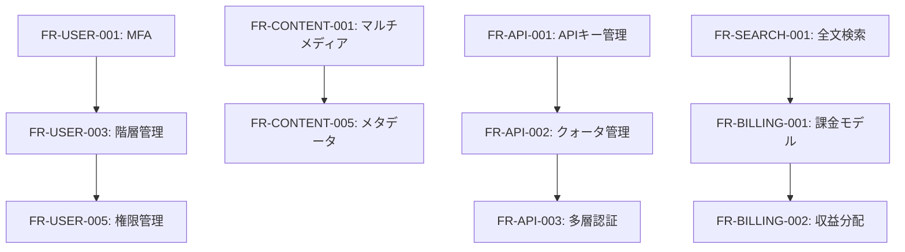
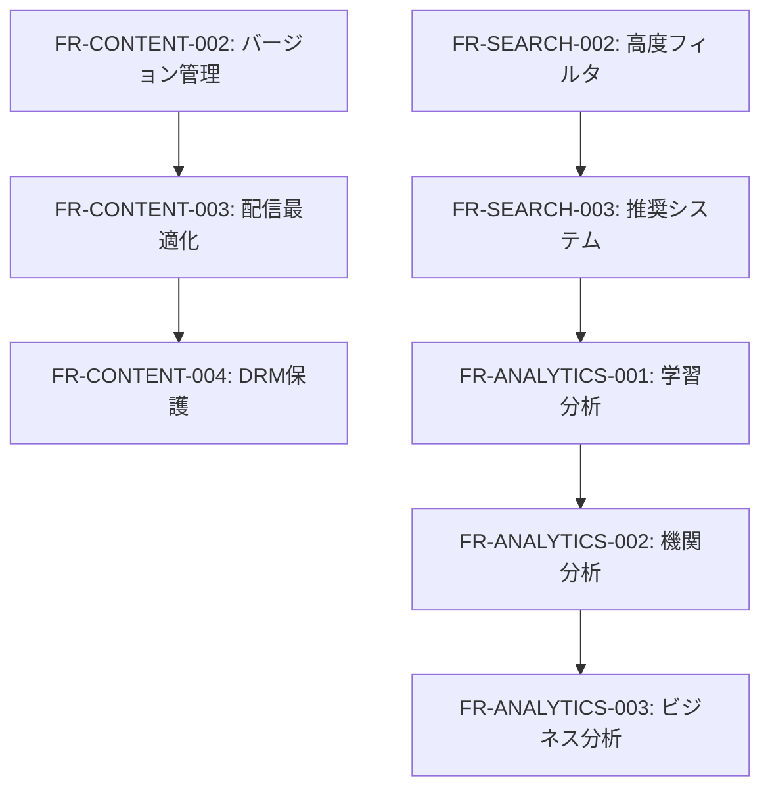

# 要件トレーサビリティマトリックス

**作成日**: 2025年10月19日  
**プロジェクト**: Tenjin MCP Hub  
**ドキュメントタイプ**: Requirements Traceability Matrix (RTM)  
**バージョン**: 1.2  

## 1. 概要

本文書では、教育機関向けマルチベンダーMCPサービスの要件トレーサビリティマトリックスを定義します。ユースケースから機能要件・非機能要件への追跡可能性を確保し、要件間の依存関係を明確にします。

### 1.1 トレーサビリティの目的
- **要件の完全性確保**: すべてのユースケースが要件で網羅されていることの確認
- **変更影響分析**: 要件変更時の影響範囲の特定
- **テスト計画**: 要件に基づくテストケース設計の支援
- **品質保証**: 要件と実装の整合性確認

## 2. ユースケース一覧

### 2.1 コンテンツプロバイダーユースケース
| UC-ID | ユースケース名 | 説明 |
|-------|----------------|------|
| UC-CP-001 | プロバイダー登録・オンボーディング | 新規コンテンツプロバイダーのプラットフォーム参加 |
| UC-CP-002 | プロバイダー認証・プロファイル管理 | プロバイダーアカウントの認証と情報管理 |
| UC-CP-003 | コンテンツアップロード・管理 | 教材コンテンツの登録・更新・管理 |
| UC-CP-004 | コンテンツバージョン管理 | コンテンツの版管理とデプロイメント |
| UC-CP-005 | コンテンツ配信・保護 | DRM機能によるコンテンツ保護と配信 |
| UC-CP-006 | 収益管理・課金設定 | 料金設定と収益分配の管理 |
| UC-CP-007 | 顧客管理・サポート | エンドユーザーサポートと顧客関係管理 |
| UC-CP-008 | 分析・レポート | ビジネス分析とパフォーマンスレポート |
| UC-CP-009 | マーケティング・プロモーション | コンテンツ販促とマーケティング活動 |
| UC-CP-010 | API統合・連携 | 既存システムとのAPI連携 |
| UC-CP-011 | コンプライアンス・監査 | 規制要件への対応と監査 |
| UC-CP-012 | プロバイダー専用APIキー発行・管理 | プロバイダー独自のAPIキー生成・管理・制御 |
| UC-CP-013 | API使用状況監視・分析 | APIキー別使用量・パフォーマンス監視 |
| UC-CP-014 | 契約情報・支払い状況管理 | 契約詳細・収益・支払い情報の管理 |
| UC-CP-015 | プロバイダー間連携・協業管理 | プロバイダー同士の協業・共同開発支援 |

### 2.2 エンドユーザーユースケース
| UC-ID | ユースケース名 | 説明 |
|-------|----------------|------|
| UC-EU-001 | アカウント作成・登録 | 新規ユーザーのアカウント作成 |
| UC-EU-002 | ユーザー認証・ログイン | セキュアなユーザー認証 |
| UC-EU-003 | 教育機関システム連携 | 既存LMSとの統合 |
| UC-EU-004 | 管理者権限・役割管理 | 教育機関内の権限管理 |
| UC-EU-005 | プライバシー・データ管理 | 個人データの管理と保護 |
| UC-EU-006 | コンテンツ閲覧・学習 | 教材の閲覧と学習活動 |
| UC-EU-007 | 学習進捗・記録管理 | 学習履歴と進捗の追跡 |
| UC-EU-008 | コンテンツ検索・発見 | 教材の検索とフィルタリング |
| UC-EU-009 | APIキー発行・管理 | 開発者向けAPIアクセス管理 |
| UC-EU-010 | 開発者向けAPI利用 | アプリケーション開発での利用 |
| UC-EU-011 | API利用監視・制限 | APIクォータと使用量監視 |
| UC-EU-012 | 学習分析・レポート | 学習データの分析と可視化 |

## 3. 機能要件トレーサビリティマトリックス

### 3.1 FR-USER: ユーザー管理機能

| 要件ID | 要件名 | 優先度 | 関連ユースケース | 依存関係 |
|--------|--------|--------|------------------|----------|
| FR-USER-001 | 多要素認証（MFA） | P0 | UC-EU-001, UC-EU-002, UC-CP-002 | NFR-SEC-001 |
| FR-USER-002 | SSO統合 | P1 | UC-EU-003, UC-CP-010 | SWR-INTEG-001 |
| FR-USER-003 | 階層的ユーザー管理 | P0 | UC-EU-004, UC-CP-001 | NFR-SEC-002 |
| FR-USER-004 | 個人データ管理 | P0 | UC-EU-005 | CR-GDPR-001 |
| FR-USER-005 | 詳細権限管理 | P0 | UC-EU-004, UC-CP-002 | FR-USER-003 |

### 3.2 FR-CONTENT: コンテンツ管理機能

| 要件ID | 要件名 | 優先度 | 関連ユースケース | 依存関係 |
|--------|--------|--------|------------------|----------|
| FR-CONTENT-001 | マルチメディアコンテンツ対応 | P0 | UC-CP-003, UC-EU-006 | SWR-DATA-001 |
| FR-CONTENT-002 | バージョン管理 | P1 | UC-CP-004 | FR-CONTENT-001 |
| FR-CONTENT-003 | コンテンツ配信最適化 | P1 | UC-EU-006, UC-CP-005 | NFR-PERF-003 |
| FR-CONTENT-004 | DRM保護 | P1 | UC-CP-005 | NFR-SEC-003 |
| FR-CONTENT-005 | 教育メタデータ標準対応 | P0 | UC-CP-003, UC-EU-008 | SWR-DATA-002 |

### 3.3 FR-API: APIキー管理機能

| 要件ID | 要件名 | 優先度 | 関連ユースケース | 依存関係 |
|--------|--------|--------|------------------|----------|
| FR-API-001 | APIキー発行・管理 | P0 | UC-EU-009 | NFR-SEC-001 |
| FR-API-002 | APIクォータ管理 | P0 | UC-EU-011 | FR-API-001 |
| FR-API-003 | 多層認証システム | P0 | UC-EU-010 | FR-USER-001 |

### 3.4 FR-SEARCH: 検索・フィルタリング機能

| 要件ID | 要件名 | 優先度 | 関連ユースケース | 依存関係 |
|--------|--------|--------|------------------|----------|
| FR-SEARCH-001 | 全文検索・意味検索 | P0 | UC-EU-008 | SWR-AZURE-003 |
| FR-SEARCH-002 | 高度フィルタリング | P1 | UC-EU-008 | FR-CONTENT-005 |
| FR-SEARCH-003 | 学習推奨システム | P1 | UC-EU-008, UC-EU-012 | FR-ANALYTICS-001 |

### 3.5 FR-BILLING: 課金・収益分配機能

| 要件ID | 要件名 | 優先度 | 関連ユースケース | 依存関係 |
|--------|--------|--------|------------------|----------|
| FR-BILLING-001 | 柔軟な課金モデル | P0 | UC-CP-006 | SWR-INTEG-003 |
| FR-BILLING-002 | 自動収益分配 | P0 | UC-CP-006 | FR-BILLING-001 |
| FR-BILLING-003 | 包括的財務レポート | P1 | UC-CP-008 | FR-ANALYTICS-003 |

### 3.6 FR-ANALYTICS: 分析・レポート機能

| 要件ID | 要件名 | 優先度 | 関連ユースケース | 依存関係 |
|--------|--------|--------|------------------|----------|
| FR-ANALYTICS-001 | 学習者行動分析 | P1 | UC-EU-012, UC-EU-007 | NFR-PERF-005 |
| FR-ANALYTICS-002 | 教育機関向け分析 | P1 | UC-EU-012 | FR-ANALYTICS-001 |
| FR-ANALYTICS-003 | プロバイダー向けビジネス分析 | P1 | UC-CP-008 | FR-BILLING-001 |

### 3.5 FR-PROVIDER: プロバイダー管理機能

| 要件ID | 要件名 | 優先度 | 関連ユースケース | 依存関係 |
|--------|--------|--------|------------------|----------|
| FR-PROVIDER-001 | プロバイダー専用APIキー発行 | P0 | UC-CP-012, UC-CP-002 | FR-USER-003 |
| FR-PROVIDER-002 | API使用量監視・制御 | P1 | UC-CP-013, UC-CP-008 | FR-PROVIDER-001 |
| FR-PROVIDER-003 | 契約情報閲覧・管理 | P0 | UC-CP-014, UC-CP-006 | FR-USER-003 |
| FR-PROVIDER-004 | 収益・支払い情報管理 | P0 | UC-CP-014, UC-CP-006 | FR-BILLING-001 |
| FR-PROVIDER-005 | 統合管理ダッシュボード | P1 | UC-CP-002, UC-CP-008, UC-CP-013 | FR-PROVIDER-001 |
| FR-PROVIDER-006 | プロバイダー間連携機能 | P2 | UC-CP-015, UC-CP-009 | FR-PROVIDER-005 |

### 3.8 FR-INTEGRATION: LMS連携機能

| 要件ID | 要件名 | 優先度 | 関連ユースケース | 依存関係 |
|--------|--------|--------|------------------|----------|
| FR-INTEGRATION-001 | 教育技術標準対応 | P0 | UC-EU-003 | SWR-DATA-003 |
| FR-INTEGRATION-002 | 主要LMS連携 | P1 | UC-EU-003 | FR-INTEGRATION-001 |
| FR-INTEGRATION-003 | リアルタイムデータ同期 | P1 | UC-EU-003, UC-CP-010 | SWR-INTEG-002 |

## 4. 非機能要件トレーサビリティマトリックス

### 4.1 NFR-PERF: パフォーマンス要件

| 要件ID | 要件名 | 関連機能要件 | 関連ユースケース |
|--------|--------|--------------|------------------|
| NFR-PERF-001 | APIレスポンス時間 | FR-API-*, FR-SEARCH-001 | UC-EU-010, UC-EU-008 |
| NFR-PERF-002 | Webアプリケーションレスポンス | FR-USER-*, FR-CONTENT-* | UC-EU-006, UC-CP-003 |
| NFR-PERF-003 | コンテンツ配信パフォーマンス | FR-CONTENT-003 | UC-EU-006 |
| NFR-PERF-004 | 同時ユーザー処理能力 | 全FR要件 | 全ユースケース |
| NFR-PERF-005 | バッチ処理性能 | FR-BILLING-002, FR-ANALYTICS-* | UC-CP-006, UC-EU-012 |

### 4.2 NFR-AVAIL: 可用性・信頼性要件

| 要件ID | 要件名 | 関連機能要件 | 関連ユースケース |
|--------|--------|--------------|------------------|
| NFR-AVAIL-001 | サービス可用性 | 全FR要件 | 全ユースケース |
| NFR-AVAIL-002 | データ整合性・永続性 | FR-CONTENT-*, FR-USER-004 | UC-CP-003, UC-EU-005 |
| NFR-AVAIL-003 | 災害復旧（DR） | 全FR要件 | 全ユースケース |
| NFR-AVAIL-004 | セキュリティインシデント対応 | FR-USER-*, FR-API-* | UC-EU-002, UC-EU-009 |

### 4.3 NFR-SEC: セキュリティ要件

| 要件ID | 要件名 | 関連機能要件 | 関連ユースケース |
|--------|--------|--------------|------------------|
| NFR-SEC-001 | 多要素認証（MFA） | FR-USER-001, FR-API-001 | UC-EU-002, UC-EU-009 |
| NFR-SEC-002 | アクセス制御 | FR-USER-005 | UC-EU-004 |
| NFR-SEC-003 | 暗号化 | FR-CONTENT-004, FR-USER-004 | UC-CP-005, UC-EU-005 |
| NFR-SEC-004 | 個人情報保護 | FR-USER-004 | UC-EU-005 |
| NFR-SEC-005 | セキュリティ監視 | 全FR要件 | 全ユースケース |

### 4.4 NFR-SCALE: スケーラビリティ要件

| 要件ID | 要件名 | 関連機能要件 | 関連ユースケース |
|--------|--------|--------------|------------------|
| NFR-SCALE-001 | 自動スケーリング | 全FR要件 | 全ユースケース |
| NFR-SCALE-002 | データベーススケーラビリティ | FR-CONTENT-*, FR-USER-* | UC-CP-003, UC-EU-001 |
| NFR-SCALE-003 | コンテンツ配信スケーラビリティ | FR-CONTENT-003 | UC-EU-006 |

### 4.5 NFR-USAB: ユーザビリティ要件

| 要件ID | 要件名 | 関連機能要件 | 関連ユースケース |
|--------|--------|--------------|------------------|
| NFR-USAB-001 | ウェブアクセシビリティ | FR-USER-*, FR-SEARCH-* | UC-EU-008, UC-EU-006 |
| NFR-USAB-002 | 多言語対応 | FR-CONTENT-005 | UC-EU-006, UC-CP-003 |
| NFR-USAB-003 | レスポンシブデザイン | 全FR要件 | 全ユースケース |

### 4.6 NFR-MAINT: 保守性・運用性要件

| 要件ID | 要件名 | 関連機能要件 | 関連ユースケース |
|--------|--------|--------------|------------------|
| NFR-MAINT-001 | システム監視 | 全FR要件 | 全ユースケース |
| NFR-MAINT-002 | ログ管理 | 全FR要件 | 全ユースケース |
| NFR-MAINT-003 | CI/CD | 全FR要件 | 全ユースケース |
| NFR-MAINT-004 | システム更新 | 全FR要件 | 全ユースケース |

## 5. ソフトウェア要件トレーサビリティマトリックス

### 5.1 SWR-MCP: MCP仕様準拠要件

| 要件ID | 要件名 | 関連機能要件 | 関連ユースケース |
|--------|--------|--------------|------------------|
| SWR-MCP-001 | MCP仕様準拠API | FR-API-*, FR-CONTENT-001 | UC-EU-010 |
| SWR-MCP-002 | MCP認証フロー | FR-API-003 | UC-EU-009 |
| SWR-MCP-003 | MCPメッセージ形式 | FR-API-*, FR-INTEGRATION-* | UC-EU-010 |

### 5.2 SWR-AZURE: Azure技術スタック要件

| 要件ID | 要件名 | 関連機能要件 | 関連ユースケース |
|--------|--------|--------------|------------------|
| SWR-AZURE-001 | Azure AD B2C統合 | FR-USER-001, FR-USER-002 | UC-EU-002, UC-EU-003 |
| SWR-AZURE-002 | Azure Container Apps | 全FR要件 | 全ユースケース |
| SWR-AZURE-003 | Azure Cognitive Search | FR-SEARCH-001 | UC-EU-008 |
| SWR-AZURE-004 | Azure Blob Storage | FR-CONTENT-001 | UC-CP-003 |

### 5.3 SWR-INTEG: 外部システム連携要件

| 要件ID | 要件名 | 関連機能要件 | 関連ユースケース |
|--------|--------|--------------|------------------|
| SWR-INTEG-001 | SAML/OAuth統合 | FR-USER-002 | UC-EU-003 |
| SWR-INTEG-002 | RESTful API | FR-INTEGRATION-003 | UC-CP-010, UC-EU-003 |
| SWR-INTEG-003 | 決済システム統合 | FR-BILLING-001 | UC-CP-006 |

### 5.4 SWR-DATA: データフォーマット要件

| 要件ID | 要件名 | 関連機能要件 | 関連ユースケース |
|--------|--------|--------------|------------------|
| SWR-DATA-001 | マルチメディア形式対応 | FR-CONTENT-001 | UC-CP-003, UC-EU-006 |
| SWR-DATA-002 | 教育メタデータ標準 | FR-CONTENT-005 | UC-CP-003 |
| SWR-DATA-003 | 教育技術標準 | FR-INTEGRATION-001 | UC-EU-003 |

## 6. コンプライアンス要件トレーサビリティマトリックス

### 6.1 CR-GDPR: GDPR準拠要件

| 要件ID | 要件名 | 関連機能要件 | 関連ユースケース |
|--------|--------|--------------|------------------|
| CR-GDPR-001 | データ主体の権利 | FR-USER-004 | UC-EU-005 |
| CR-GDPR-002 | 同意管理 | FR-USER-004 | UC-EU-001, UC-EU-005 |
| CR-GDPR-003 | データ保護影響評価 | FR-USER-004 | UC-CP-011 |

### 6.2 CR-COPPA: COPPA準拠要件

| 要件ID | 要件名 | 関連機能要件 | 関連ユースケース |
|--------|--------|--------------|------------------|
| CR-COPPA-001 | 保護者同意 | FR-USER-004 | UC-EU-001 |
| CR-COPPA-002 | 13歳未満データ保護 | FR-USER-004 | UC-EU-005 |

### 6.3 CR-FERPA: FERPA準拠要件

| 要件ID | 要件名 | 関連機能要件 | 関連ユースケース |
|--------|--------|--------------|------------------|
| CR-FERPA-001 | 教育記録保護 | FR-ANALYTICS-001 | UC-EU-007, UC-EU-012 |
| CR-FERPA-002 | 機関間データ共有 | FR-INTEGRATION-003 | UC-EU-003 |

### 6.4 CR-SOC2: SOC 2準拠要件

| 要件ID | 要件名 | 関連機能要件 | 関連ユースケース |
|--------|--------|--------------|------------------|
| CR-SOC2-001 | セキュリティ統制 | NFR-SEC-* | 全ユースケース |
| CR-SOC2-002 | 可用性統制 | NFR-AVAIL-* | 全ユースケース |
| CR-SOC2-003 | 機密性統制 | NFR-SEC-003, NFR-SEC-004 | UC-EU-005, UC-CP-005 |

## 7. 要件依存関係分析

### 7.1 MVP Phase 1 依存関係

### 7.2 Phase 2 依存関係

## 8. テスト要件マッピング

### 8.1 受け入れテスト

| テスト種別 | 対象要件 | 関連ユースケース |
|------------|----------|------------------|
| ユーザー受け入れテスト | FR-USER-*, NFR-USAB-* | UC-EU-001〜012 |
| プロバイダー受け入れテスト | FR-CONTENT-*, FR-BILLING-* | UC-CP-001〜011 |
| セキュリティテスト | NFR-SEC-*, CR-* | 全ユースケース |
| パフォーマンステスト | NFR-PERF-*, NFR-SCALE-* | 全ユースケース |

### 8.2 統合テスト

| 統合ポイント | 対象要件 | 関連ユースケース |
|--------------|----------|------------------|
| API統合 | FR-API-*, SWR-MCP-* | UC-EU-009, UC-EU-010 |
| LMS統合 | FR-INTEGRATION-*, SWR-INTEG-* | UC-EU-003 |
| 決済統合 | FR-BILLING-*, SWR-INTEG-003 | UC-CP-006 |

## 9. 変更影響分析テンプレート

### 9.1 要件変更時の影響確認項目

1. **直接影響**
   - 変更対象要件
   - 依存している要件
   - 関連ユースケース

2. **間接影響**
   - アーキテクチャ設計への影響
   - 他の要件への波及効果
   - テスト計画への影響

3. **実装影響**
   - 開発スケジュールへの影響
   - リソース配分の変更
   - リスクの再評価

## 10. 要件承認状況追跡

### 10.1 承認マトリックス

| 要件カテゴリ | ステークホルダー | 承認状況 | 承認日 |
|--------------|------------------|----------|--------|
| FR-USER | 教育機関代表 | ✅ 承認済 | 2025-10-19 |
| FR-CONTENT | プロバイダー代表 | ✅ 承認済 | 2025-10-19 |
| FR-API | 開発者代表 | ✅ 承認済 | 2025-10-19 |
| NFR-PERF | 技術責任者 | ✅ 承認済 | 2025-10-19 |
| NFR-SEC | セキュリティ責任者 | ✅ 承認済 | 2025-10-19 |
| CR-* | 法務責任者 | ✅ 承認済 | 2025-10-19 |

---

**関連文書**:
- [要件定義書概要](00-requirements-overview.md)
- [機能要件詳細定義書](02-functional-requirements.md)
- [非機能要件詳細定義書](03-non-functional-requirements.md)
- [コンテンツプロバイダーユースケース](../usecases/content-provider-usecases.md)
- [エンドユーザーユースケース](../usecases/end-user-usecases.md)