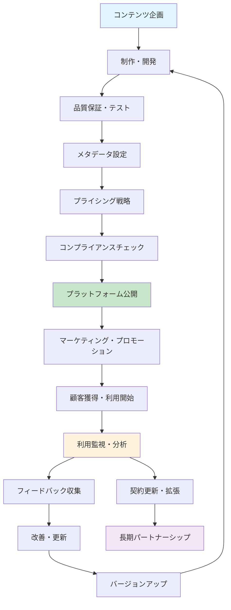
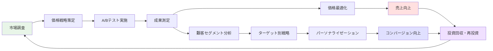

# コンテンツプロバイダー企業ユースケース設計書

**作成日**: 2025年10月19日  
**プロジェクト**: Tenjin MCP Hub  
**対象**: コンテンツプロバイダー企業  

## 1. エグゼクティブサマリー

### 1.1 概要
教育機関向けマルチベンダーMCPサービスにおける、コンテンツプロバイダー企業の包括的なユースケースを定義します。大手出版社から個人クリエイターまで、多様な規模・業態のプロバイダーが効率的にコンテンツを配信・管理・収益化できるエコシステムを設計します。

### 1.2 対象プロバイダー企業タイプ
- **大手教育出版社** (例: Pearson, McGraw-Hill)
- **教育テクノロジー企業** (例: Khan Academy, Coursera)
- **専門コンテンツ制作会社**
- **個人教育者・専門家**
- **大学・研究機関**
- **企業研修部門**

## 2. プロバイダー企業ペルソナ

### 2.1 ペルソナ1: 大手教育出版社（EdTech Publishing Corp）

**基本情報**:
- 企業規模: 1,000+従業員
- 年間売上: $500M+
- 既存顧客: 10,000+教育機関
- コンテンツ: K-12教科書、デジタル教材

**ニーズ**:
- 大規模コンテンツライブラリの効率管理
- グローバル配信・多言語対応
- 詳細な利用分析・ROI測定
- 既存システムとの統合

**ペインポイント**:
- 複雑なライセンス管理
- 海賊版・不正利用対策
- 教育機関との直接契約の煩雑さ
- デジタル化の技術的障壁

**成功指標**:
- 月間アクティブユーザー数
- コンテンツ利用時間
- ライセンス更新率
- 新規顧客獲得数

### 2.2 ペルソナ2: 中堅EdTech企業（InnoLearn Solutions）

**基本情報**:
- 企業規模: 50-200従業員
- 年間売上: $10M-50M
- 既存顧客: 500+教育機関
- コンテンツ: インタラクティブ学習ツール、STEM教材

**ニーズ**:
- 市場拡大・新規顧客開拓
- 運用コスト削減
- 迅速な市場投入
- データ駆動の意思決定

**ペインポイント**:
- 限られたマーケティング予算
- 技術リソースの制約
- 競合との差別化
- 顧客サポートの負荷

**成功指標**:
- 市場シェア拡大
- 顧客獲得コスト削減
- 製品開発サイクル短縮
- 顧客満足度向上

### 2.3 ペルソナ3: 個人専門家（Dr. Sarah Chen - 数学教育専門家）

**基本情報**:
- 背景: 元大学教授、独立教育コンサルタント
- 専門分野: 高等数学、統計学
- 既存顧客: 50+教育機関、1,000+個人学習者
- コンテンツ: 専門講義動画、演習問題集

**ニーズ**:
- 簡単なコンテンツ投稿・管理
- 収益の最大化
- 教育への社会貢献
- ブランディング強化

**ペインポイント**:
- 技術的知識の不足
- マーケティング能力の限界
- 時間リソースの制約
- 品質保証の困難

**成功指標**:
- 月間収益
- コンテンツ視聴回数
- 学習者からの評価
- 専門分野での認知度

## 3. 主要ユースケース

### 3.1 プロバイダーオンボーディング

#### UC-P001: 新規プロバイダー登録
**アクター**: 新規コンテンツプロバイダー
**前提条件**: 有効な企業情報・身元確認書類を持つ
**メインフロー**:
1. プロバイダーがオンボーディングポータルにアクセス
2. 企業情報・連絡先・法的文書をアップロード
3. システムが自動的に基本審査を実行
4. プラットフォーム管理者が手動レビューを実施
5. 承認後、プロバイダーアカウントが活性化
6. 初期設定ウィザードでプロファイル完成
7. APIキー・認証情報が発行される

**代替フロー**:
- A1: 審査で問題が発見された場合
  - システムが具体的なフィードバックを提供
  - プロバイダーが修正・再提出
- A2: 大企業の場合の専用オンボーディング
  - 専任カスタマーサクセス担当者がアサイン
  - カスタム統合・移行支援

**事後条件**: プロバイダーがプラットフォームでコンテンツ配信可能

#### UC-P002: プロバイダープロファイル設定
**アクター**: 承認済みプロバイダー
**前提条件**: アクティブなプロバイダーアカウント
**メインフロー**:
1. プロバイダーポータルにログイン
2. 企業ブランディング情報設定（ロゴ、色彩、説明）
3. コンテンツカテゴリー・対象層定義
4. 価格モデル・ライセンス条件設定
5. 支払い情報・税務情報入力
6. API統合設定（必要に応じて）
7. 設定内容をプレビュー・確認
8. 公開設定の有効化

**代替フロー**:
- A1: 企業ブランディングガイドライン違反
  - システムが自動チェック・警告表示
  - 修正推奨事項の提示

### 3.2 コンテンツ管理

#### UC-P003: 新規コンテンツアップロード
**アクター**: コンテンツクリエイター（プロバイダー社員）
**前提条件**: コンテンツ作成権限を持つ
**メインフロー**:
1. プロバイダーポータルでコンテンツ作成開始
2. コンテンツタイプ選択（動画、PDF、インタラクティブ等）
3. ファイルアップロード（進捗表示・エラーハンドリング）
4. メタデータ入力（タイトル、説明、タグ、対象層）
5. 学習目標・評価基準設定
6. プレビュー・品質確認
7. ライセンス条件・価格設定
8. コンプライアンスチェック実行
9. 公開承認ワークフロー開始

**代替フロー**:
- A1: 大容量ファイルの場合
  - チャンク分割アップロード
  - バックグラウンド処理・通知
- A2: コンプライアンス違反検出
  - 自動フラグ・人手レビュー待機
  - 修正ガイダンス提供

**事後条件**: コンテンツがカタログに追加され、検索可能

#### UC-P004: コンテンツバージョン管理
**アクター**: コンテンツクリエイター
**前提条件**: 既存公開コンテンツを持つ
**メインフロー**:
1. 既存コンテンツの編集開始
2. 新バージョン作成（自動バックアップ）
3. 変更内容の記録・コメント追加
4. 既存ライセンス契約への影響確認
5. 段階的ロールアウト設定（必要に応じて）
6. 利用者への変更通知設定
7. 新バージョンの公開実行

**代替フロー**:
- A1: 破壊的変更の場合
  - 既存ユーザーに事前通知
  - 移行期間・サポート提供
- A2: 緊急修正の場合
  - 即座リリース・後追い通知

### 3.3 販売・ライセンス管理

#### UC-P005: 価格戦略設定
**アクター**: プロバイダービジネス担当者
**前提条件**: 公開コンテンツを持つ
**メインフロー**:
1. 価格設定ダッシュボードにアクセス
2. 市場分析データ・競合価格確認
3. 価格モデル選択（サブスク、買い切り、従量制等）
4. 地域別・顧客層別価格設定
5. 割引・プロモーション計画作成
6. A/Bテスト設定（複数価格の検証）
7. 価格変更スケジュール設定
8. 既存顧客への影響分析・通知

**代替フロー**:
- A1: 大口顧客向けカスタム価格
  - 個別交渉・承認ワークフロー
- A2: 市場変動への緊急対応
  - 動的価格調整・自動アラート

#### UC-P006: ライセンス契約管理
**アクター**: プロバイダーライセンス担当者
**前提条件**: 販売実績のあるコンテンツ
**メインフロー**:
1. ライセンス管理ダッシュボード確認
2. アクティブ契約一覧・ステータス確認
3. 更新期限の迫る契約に対する対応計画
4. カスタムライセンス条件の設定・変更
5. 利用制限・地域制限の管理
6. 契約違反・異常利用の監視
7. 自動更新・解約処理の設定
8. 法的コンプライアンス確認

**代替フロー**:
- A1: 契約違反検出時
  - 自動警告・段階的制裁措置
  - 法務部門との連携フロー

### 3.4 分析・レポーティング

#### UC-P007: 売上・利用分析
**アクター**: プロバイダー分析担当者
**前提条件**: 販売・利用データを持つ
**メインフロー**:
1. 分析ダッシュボードにアクセス
2. 期間・フィルター条件設定
3. 売上推移・トレンド分析確認
4. コンテンツ別パフォーマンス比較
5. 地域別・顧客セグメント別分析
6. 学習効果・満足度指標確認
7. 競合比較・市場ポジション分析
8. カスタムレポート作成・エクスポート
9. 定期レポート配信設定

**代替フロー**:
- A1: リアルタイム監視の場合
  - ライブダッシュボード・アラート設定
- A2: 詳細データが必要な場合
  - 生データエクスポート・API連携

#### UC-P008: 学習効果測定
**アクター**: プロバイダー教育研究者
**前提条件**: 学習進捗データへのアクセス権限
**メインフロー**:
1. 学習分析ツールにアクセス
2. 対象コンテンツ・期間選択
3. 学習者の進捗・完了率確認
4. 学習時間・頻度分析
5. 評価結果・理解度測定
6. 学習パス・推奨コンテンツ効果分析
7. A/Bテスト結果確認（教材設計改善）
8. 教育効果レポート作成
9. 改善提案・次期開発計画策定

### 3.5 顧客関係管理

#### UC-P009: 顧客サポート対応
**アクター**: プロバイダーカスタマーサポート
**前提条件**: 顧客からの問い合わせ
**メインフロー**:
1. 問い合わせ受信・チケット作成
2. 顧客情報・利用履歴確認
3. 問題カテゴリー分類・優先度設定
4. 技術的問題の場合の調査・再現
5. 解決方法の提示・実装支援
6. 顧客フィードバック収集
7. 解決状況確認・チケットクローズ
8. ナレッジベース更新・共有

**代替フロー**:
- A1: 技術的エスカレーション
  - 開発チーム・専門家への引き継ぎ
- A2: 大口顧客の優先対応
  - 専任担当者・SLA保証

#### UC-P010: 顧客リレーションシップ構築
**アクター**: プロバイダーアカウントマネージャー
**前提条件**: 重要顧客リスト
**メインフロー**:
1. 顧客ポートフォリオ・健康度確認
2. 定期チェックイン・ミーティング設定
3. 利用状況・満足度ヒアリング
4. 新機能・アップデート情報提供
5. カスタマイゼーション提案
6. 契約更新・拡張営業
7. 成功事例・ケーススタディ作成
8. 長期パートナーシップ戦略策定

### 3.6 プラットフォーム連携

#### UC-P011: サードパーティシステム統合
**アクター**: プロバイダーIT担当者
**前提条件**: 既存システム・APIドキュメント
**メインフロー**:
1. 統合要件・仕様確認
2. API認証情報・エンドポイント設定
3. データマッピング・変換ルール定義
4. テスト環境でのプロトタイプ開発
5. データ同期・整合性確認
6. エラーハンドリング・復旧手順設定
7. 本番環境への展開・監視設定
8. 運用手順書・ドキュメント整備

**代替フロー**:
- A1: 複雑なカスタム統合
  - プロフェッショナルサービス活用
- A2: レガシーシステム対応
  - 中間層・データ変換サービス利用

### 3.3 プロバイダー管理・API運用

#### UC-P012: プロバイダー専用APIキー発行・管理
**アクター**: プロバイダー管理者、プロバイダー開発者
**前提条件**: アクティブなプロバイダーアカウント、API利用権限
**メインフロー**:
1. プロバイダーポータルのAPI管理セクションにアクセス
2. 新規APIキー生成リクエストを作成
3. APIキーの用途・権限スコープを設定
   - 読み取り専用（コンテンツ閲覧・検索）
   - 読み書き（コンテンツ更新・メタデータ編集）
   - 管理者権限（ユーザー管理・設定変更）
4. 有効期限・使用制限を設定（無期限、1年、6か月、3か月、1か月）
5. IP制限・アクセス許可範囲を定義
6. APIキーを生成・表示（一回限りの表示）
7. APIキー使用方法・サンプルコードを提供
8. 生成されたAPIキーをセキュアに保存・管理

**代替フロー**:
- A1: APIキー制限数到達
  - 既存APIキーの削除・整理を促進
  - 上位プランへのアップグレード提案
- A2: セキュリティ違反検出
  - APIキーの即座無効化
  - セキュリティ監査・再発防止策実施

**事後条件**: プロバイダーが独自APIキーでシステム利用可能

#### UC-P013: API使用状況監視・分析
**アクター**: プロバイダー管理者、プロバイダー開発者
**前提条件**: 発行済みAPIキー、API利用実績
**メインフロー**:
1. API管理ダッシュボードにアクセス
2. リアルタイム使用状況を確認
   - 現在のリクエスト数・レスポンス時間
   - エラー率・成功率の監視
   - 同時接続数・帯域使用量
3. 詳細な使用統計を分析
   - 時間別・日別・月別の利用傾向
   - エンドポイント別の利用状況
   - 地域別・デバイス別のアクセス分析
4. アラート・通知設定を管理
   - 使用量上限達成時の自動通知
   - 異常なアクセスパターンの検出
   - システムメンテナンス・障害通知
5. レート制限・クォータ設定を調整
6. 使用状況レポートを生成・ダウンロード

**代替フロー**:
- A1: 使用量急増・異常検出
  - 自動的なレート制限発動
  - プロバイダーへの緊急通知・調査
- A2: APIキー漏洩疑い
  - 該当APIキーの一時停止
  - セキュリティ調査・新キー発行

**事後条件**: API利用状況の完全な可視化・制御

#### UC-P014: 契約情報・支払い状況管理
**アクター**: プロバイダー経理担当者、プロバイダー管理者
**前提条件**: 有効なプロバイダー契約、課金設定完了
**メインフロー**:
1. プロバイダーポータルの契約管理セクションにアクセス
2. 現在の契約ステータスを確認
   - 契約開始日・終了日・自動更新設定
   - 契約プラン詳細（ストレージ容量、帯域制限、手数料率）
   - 契約変更・アップグレード履歴
3. 収益・支払い情報を詳細確認
   - 月次・四半期・年次の売上レポート
   - コンテンツ別・顧客別の収益分析
   - プラットフォーム手数料・控除額の詳細
4. 支払い予定・履歴を管理
   - 次回支払い予定日・金額確認
   - 過去の支払い履歴・明細書ダウンロード
   - 支払い方法変更・更新
5. 税務関連書類を生成・管理
   - 請求書・領収書の自動生成
   - 税務報告書・支払調書の作成
   - 多通貨・国際税務対応
6. 契約更新・変更申請を処理
   - オンライン契約更新手続き
   - プラン変更・追加オプション申請
   - デジタル署名・電子契約書作成

**代替フロー**:
- A1: 支払い遅延・問題発生
  - 自動督促・通知システム
  - 支払い相談・分割払い設定
- A2: 契約解約申請
  - 解約理由調査・リテンション施策
  - データ移行・削除手続き

**事後条件**: 契約・収益情報の透明性・管理効率向上

#### UC-P015: プロバイダー間連携・協業管理
**アクター**: プロバイダー管理者、パートナー企業担当者
**前提条件**: 複数のアクティブプロバイダー、連携契約
**メインフロー**:
1. プロバイダーポータルの連携管理セクションにアクセス
2. 連携可能なパートナープロバイダーを検索・発見
3. 連携提案・協業申請を送信
   - 共同開発コンテンツの企画提案
   - コンテンツバンドリングの提案
   - 相互マーケティング・プロモーション企画
4. 連携契約・条件を交渉・合意
   - 収益分配比率の設定
   - 責任範囲・役割分担の明確化
   - 品質基準・納期の合意
5. 共同プロジェクトを管理・進行
   - プロジェクト管理ツールでの進捗共有
   - リソース・スケジュール調整
   - 品質管理・レビュープロセス
6. 連携成果・収益を分析・配分
   - 共同コンテンツの利用状況分析
   - 収益自動配分・支払い処理
   - 連携効果測定・改善提案

**代替フロー**:
- A1: 連携トラブル・紛争発生
  - 調停・仲裁システムの活用
  - エスカレーション・第三者介入
- A2: 連携解消・終了
  - 資産分割・権利移譲手続き
  - 継続サポート・移行支援

**事後条件**: プロバイダー間の効果的な協業・価値創造

## 4. ビジネスプロセスフロー

### 4.1 コンテンツライフサイクル管理

### 4.2 収益最適化プロセス

## 5. プロバイダー成功指標（KPI）

### 5.1 収益指標
- **月間経常収益（MRR）**: サブスクリプション収益
- **年間契約価値（ACV）**: 年間平均契約額
- **顧客生涯価値（LTV）**: 顧客から得られる総収益
- **収益成長率**: 前年同期比成長率

### 5.2 市場・顧客指標
- **新規顧客獲得数**: 月間・四半期新規契約
- **顧客獲得コスト（CAC）**: マーケティング投資効率
- **顧客解約率（Churn Rate）**: 既存顧客の離脱率
- **ネットプロモータースコア（NPS）**: 顧客満足度・推奨度

### 5.3 プロダクト指標
- **月間アクティブユーザー（MAU）**: コンテンツ利用者数
- **エンゲージメント率**: 学習完了率・時間
- **コンテンツ利用率**: 公開コンテンツの活用度
- **学習効果スコア**: 教育成果測定

### 5.4 運用効率指標
- **サポートチケット解決時間**: 顧客対応効率
- **システム稼働率**: プラットフォーム安定性
- **API応答時間**: 技術的パフォーマンス
- **コンテンツ公開時間**: アップロードから公開まで

## 6. 成功事例シナリオ

### 6.1 シナリオ1: 大手出版社のデジタル変革

**背景**: 
Traditional Educational Publishers Inc.（年商$800M）は紙媒体中心のビジネスモデルから、デジタルファーストへの転換を図っている。

**課題**:
- 既存の印刷教材のデジタル化
- 新しい収益モデルの構築
- 競合EdTech企業への対抗
- グローバル市場への迅速な展開

**MCPプラットフォーム活用**:
1. **段階的移行**: 既存人気教材のデジタル版を優先投入
2. **ハイブリッドライセンス**: 紙+デジタルバンドル販売
3. **データ活用**: 学習者行動分析による教材改善
4. **グローバル展開**: 多言語対応・地域別価格設定

**成果**:
- デジタル収益が全体の40%に成長（2年間で）
- 新規市場での顧客獲得200%増
- 学習効果向上（テストスコア平均15%改善）
- 運用コスト30%削減（印刷・流通費用減）

### 6.2 シナリオ2: 中堅EdTech企業の急成長

**背景**:
STEM Learning Innovations（年商$25M）は高品質な科学・数学教材を提供するEdTech企業。より大きな市場への展開を目指している。

**課題**:
- 限られたマーケティング予算
- 競合大手企業との差別化
- 国際展開のリソース不足
- 技術インフラの拡張性

**MCPプラットフォーム活用**:
1. **マーケットプレイス効果**: プラットフォームの集客力活用
2. **差別化戦略**: インタラクティブ・VR教材の特化投入
3. **パートナーシップ**: 大手企業との協業コンテンツ開発
4. **データ駆動開発**: 学習者フィードバックによる迅速な改善

**成果**:
- 売上3倍成長（年商$75Mに）
- 海外市場売上が全体の50%に
- 開発効率40%向上（データ駆動意思決定）
- 顧客満足度95%達成

### 6.3 シナリオ3: 個人専門家のブランド構築

**背景**:
Dr. Maria Rodriguez（言語学博士）は大学を退職後、独立して語学教育コンテンツを提供している。

**課題**:
- 個人ブランドの認知度向上
- 技術的知識・リソースの不足
- 安定した収益源の確保
- 大規模な学習者リーチ

**MCPプラットフォーム活用**:
1. **簡単投稿**: 技術知識不要の直感的アップロード
2. **プロモーション支援**: プラットフォームの推奨アルゴリズム
3. **収益最適化**: 動的価格設定・バンドル販売
4. **コミュニティ構築**: 学習者との直接交流機能

**成果**:
- 月間収益$50,000達成（従来の10倍）
- 国際的な認知度向上（30カ国での利用）
- 出版契約・講演依頼の増加
- 教育業界でのソートリーダー地位確立

## 7. リスク管理・緊急対応

### 7.1 ビジネスリスク

#### コンテンツ海賊版・不正利用
**対策**:
- DRM（デジタル著作権管理）実装
- ウォーターマーク・フィンガープリント技術
- 異常利用パターンの検知・自動停止
- 法的対応・ISPとの連携

#### 競合他社との差別化困難
**対策**:
- 独自性の高いコンテンツ投資
- 学習効果データによる価値証明
- 顧客ロックイン・スイッチングコスト向上
- 戦略的パートナーシップ構築

### 7.2 技術リスク

#### プラットフォーム障害・ダウンタイム
**対策**:
- 99.9%可用性SLA保証
- 自動フェイルオーバー・冗長化
- リアルタイム監視・アラート
- 障害時の代替アクセス手段

#### データ漏洩・セキュリティ侵害
**対策**:
- エンドツーエンド暗号化
- 定期的セキュリティ監査
- 侵入検知・防御システム
- インシデント対応計画・演習

### 7.3 法的・コンプライアンスリスク

#### 教育データプライバシー違反
**対策**:
- GDPR、COPPA、FERPA完全準拠
- プライバシーバイデザイン実装
- 定期的コンプライアンス監査
- 法的専門家チームとの連携

#### 知的財産権侵害
**対策**:
- コンテンツ投稿時の自動チェック
- 著作権データベース照合
- クリエイター向け知財教育
- 迅速な削除・対応プロセス

## 8. 今後の発展・ロードマップ

### 8.1 短期（6ヶ月）
- **AI推奨エンジン**: 学習者向けパーソナライゼーション
- **モバイルアプリ**: プロバイダー管理アプリ
- **高度分析**: リアルタイムダッシュボード強化
- **国際化**: 多言語・多通貨対応

### 8.2 中期（1年）
- **VR/AR対応**: 没入型教材プラットフォーム
- **ブロックチェーン**: 透明な収益分配・著作権管理
- **AI自動生成**: コンテンツ作成支援ツール
- **ソーシャル機能**: プロバイダー間コラボレーション

### 8.3 長期（2年+）
- **グローバル統合**: 地域プラットフォーム統合
- **教育メタバース**: 仮想世界での学習体験
- **量子暗号**: 次世代セキュリティ実装
- **AGI連携**: 人工汎用知能による教育最適化

---

**文書バージョン**: 1.0  
**最終更新**: 2025年10月19日  
**次回レビュー**: 2025年11月19日