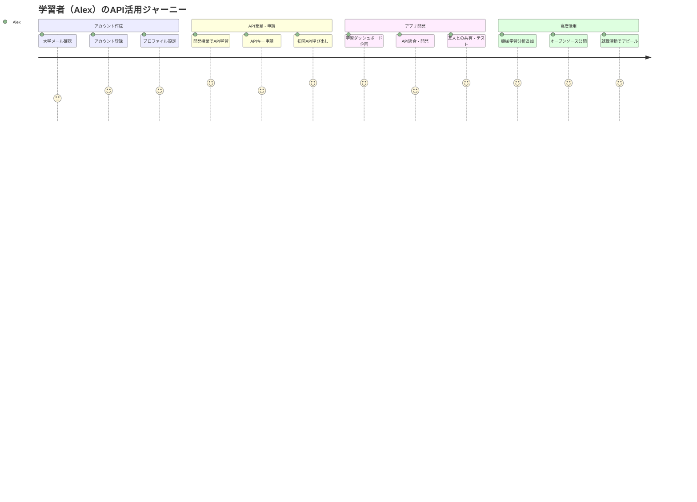
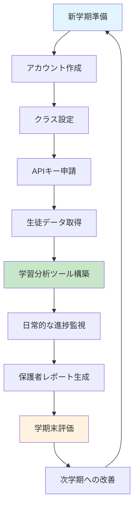

# 利用者ユースケース設計書

**作成日**: 2025年10月19日  
**プロジェクト**: Tenjin MCP Hub  
**対象**: 教育機関利用者（学習者・教育者・管理者）  

## 1. エグゼクティブサマリー

### 1.1 概要
教育機関向けマルチベンダーMCPサービスにおける、エンドユーザー（学習者、教育者、教育機関管理者）の包括的なユースケースを定義します。アカウント作成からAPIキー発行・管理、実際のAPI利用まで、教育現場での実践的な活用シナリオを設計します。

### 1.2 対象利用者
- **学習者** (Students): 小学生〜大学生、社会人学習者
- **教育者** (Educators): 教師、講師、インストラクター、チューター
- **教育機関管理者** (Institution Admins): IT管理者、教務担当者、システム管理者
- **開発者** (Developers): 教育アプリ開発者、研究者、技術者

## 2. 利用者ペルソナ

### 2.1 ペルソナ1: 大学生（Alex Chen - コンピューターサイエンス専攻）

**基本情報**:
- 年齢: 20歳
- 学年: 大学3年生
- 専攻: コンピューターサイエンス
- 技術レベル: 中級〜上級

**ニーズ**:
- プログラミング学習の効率化
- 自動化ツールの作成
- 学習進捗の可視化
- カスタム学習アプリの開発

**ペインポイント**:
- 複数プラットフォームの分散
- 学習データの統合困難
- APIアクセスの複雑さ
- コスト制約

**APIキー利用目的**:
- 学習進捗データの取得
- カスタム学習ダッシュボード作成
- 自動レポート生成
- 学習分析アプリ開発

### 2.2 ペルソナ2: 高校教師（Ms. Sarah Johnson - 数学教師）

**基本情報**:
- 年齢: 35歳
- 経験: 教職12年
- 担当: 高校数学（代数・幾何学）
- 技術レベル: 初級〜中級

**ニーズ**:
- 生徒の学習状況把握
- 効果的な教材選択
- 自動化された成績管理
- 保護者向けレポート作成

**ペインポイント**:
- 技術的知識の限界
- 時間リソースの不足
- 複雑な管理ツール
- データ分析の困難

**APIキー利用目的**:
- 生徒進捗の一括取得
- 成績レポート自動生成
- 教材推奨システム構築
- 保護者通知システム

### 2.3 ペルソナ3: 教育機関IT管理者（Dr. Michael Rodriguez - 大学IT部門長）

**基本情報**:
- 年齢: 45歳
- 職位: IT部門長
- 管理対象: 15,000名の学生・教職員
- 技術レベル: 上級

**ニーズ**:
- システム統合・連携
- セキュリティ管理
- 大規模データ処理
- コンプライアンス対応

**ペインポイント**:
- 複雑なシステム統合
- セキュリティリスク管理
- 予算制約
- 法的コンプライアンス

**APIキー利用目的**:
- LMS統合・データ同期
- 一括ユーザー管理
- セキュリティ監視
- コンプライアンス報告

### 2.4 ペルソナ4: 教育アプリ開発者（Emma Thompson - EdTechスタートアップ）

**基本情報**:
- 年齢: 28歳
- 職業: フルスタック開発者
- 会社: 小規模EdTechスタートアップ
- 技術レベル: 上級

**ニーズ**:
- 豊富な教材データアクセス
- 高性能API
- 開発効率向上
- スケーラブルな統合

**ペインポイント**:
- API制限・コスト
- データ品質の不安
- 複雑な認証システム
- ドキュメント不足

**APIキー利用目的**:
- 教材データ取得・検索
- ユーザー進捗追跡
- AI学習推奨システム
- カスタム分析ツール

## 3. 主要ユースケース

### 3.1 アカウント管理

#### UC-U001: 新規アカウント作成
**アクター**: 新規利用者
**前提条件**: 有効なメールアドレスと教育機関所属を持つ
**メインフロー**:
1. 利用者が登録ページにアクセス
2. 基本情報入力（名前、メール、教育機関、役割）
3. 教育機関ドメイン認証または所属証明書アップロード
4. メール認証コード送信・確認
5. パスワード設定・セキュリティ質問設定
6. 利用規約・プライバシーポリシー同意
7. アカウント作成完了・ウェルカムメール送信
8. 初期設定ガイダンス表示

**代替フロー**:
- A1: 教育機関が事前登録済みの場合
  - ドメイン自動認証・即座承認
- A2: 教育機関が未登録の場合
  - 管理者承認待ち・手動審査
- A3: 13歳未満の学習者の場合
  - 保護者同意プロセス（COPPA対応）

**事後条件**: 有効なアカウントが作成され、基本サービス利用可能

#### UC-U002: プロファイル設定・管理
**アクター**: 登録済み利用者
**前提条件**: 有効なアカウントを持つ
**メインフロー**:
1. ユーザーダッシュボードにログイン
2. プロファイル設定ページにアクセス
3. 個人情報更新（写真、連絡先、専門分野）
4. 学習目標・興味分野設定
5. 通知設定・プライバシー設定
6. 言語・タイムゾーン設定
7. アクセシビリティ設定（必要に応じて）
8. 変更内容保存・確認

**代替フロー**:
- A1: 未成年学習者の場合
  - 保護者による設定制限・承認
- A2: 教育機関管理者の場合
  - 組織設定・権限管理追加

### 3.2 APIキー管理

#### UC-U003: APIキー発行申請
**アクター**: 認証済み利用者
**前提条件**: 有効なアカウントとAPI利用権限
**メインフロー**:
1. ダッシュボードの「API管理」セクションにアクセス
2. 「新規APIキー作成」ボタンクリック
3. APIキー用途・目的説明入力
4. 必要な権限スコープ選択
   - 読み取り専用 (read-only)
   - 学習進捗アクセス (progress)
   - 教材検索 (content-search)
   - ユーザー管理 (user-management) ※管理者のみ
5. 利用期間・更新設定
6. レート制限・利用制限確認
7. APIキー生成・表示
8. セキュリティ注意事項確認
9. APIキー安全な保存（ユーザー責任）

**代替フロー**:
- A1: 学習者の場合
  - 制限付きスコープ・承認不要
- A2: 教育者の場合
  - 中級スコープ・自動承認
- A3: 管理者の場合
  - 全スコープ・管理者承認
- A4: 商用利用の場合
  - 特別承認プロセス・利用規約確認

**事後条件**: 有効なAPIキーが発行され、API利用可能

#### UC-U004: APIキー管理・監視
**アクター**: APIキー所有者
**前提条件**: 発行済みAPIキーを持つ
**メインフロー**:
1. API管理ダッシュボードにアクセス
2. 所有APIキー一覧表示
3. 各APIキーの詳細情報確認
   - 作成日・有効期限
   - 権限スコープ・制限
   - 利用統計・レート制限状況
4. APIキー利用履歴・ログ確認
5. 異常アクセス・セキュリティアラート確認
6. APIキー設定変更（必要に応じて）
7. APIキー更新・再生成
8. 不要なAPIキーの無効化・削除

**代替フロー**:
- A1: セキュリティ侵害検出時
  - 自動無効化・緊急通知
- A2: 利用制限超過時
  - アップグレード提案・制限調整

#### UC-U005: APIキー利用状況分析
**アクター**: APIキー所有者
**前提条件**: APIキー利用実績を持つ
**メインフロー**:
1. 分析ダッシュボードにアクセス
2. 期間・APIキー選択
3. 利用統計確認
   - リクエスト数・エラー率
   - 応答時間・パフォーマンス
   - 人気エンドポイント・機能
4. コスト分析（従量課金の場合）
5. 最適化提案確認
6. 利用パターン・トレンド分析
7. レポート生成・エクスポート
8. アラート・通知設定

### 3.3 API利用シナリオ

#### UC-U006: 学習進捗データ取得
**アクター**: 学習者・教育者
**前提条件**: 有効なAPIキーと進捗データアクセス権限
**メインフロー**:
1. API認証（Bearer token）
2. 進捗データエンドポイント呼び出し
3. フィルター条件指定
   - 期間範囲・コンテンツタイプ
   - 科目・カテゴリー
   - 完了状況・評価
4. データ取得・JSON形式で受信
5. アプリケーションでのデータ処理
6. 学習分析・可視化
7. レポート生成・共有

**APIエンドポイント例**:
```
GET /api/v1/users/{userId}/progress
Authorization: Bearer {api_key}
Query Parameters:
- start_date: 2025-01-01
- end_date: 2025-10-19
- content_type: video,interactive
- subject: mathematics,science
```

#### UC-U007: 教材検索・推奨
**アクター**: 教育者・学習者
**前提条件**: 有効なAPIキーと教材アクセス権限
**メインフロー**:
1. API認証
2. 検索条件設定
   - キーワード・タグ
   - 学習レベル・対象年齢
   - コンテンツタイプ・長さ
   - ライセンス・価格範囲
3. 検索API呼び出し
4. 結果取得・フィルタリング
5. 推奨アルゴリズム適用
6. 個人化された結果表示
7. 教材詳細情報取得
8. お気に入り・プレイリスト追加

**APIエンドポイント例**:
```
GET /api/v1/content/search
Authorization: Bearer {api_key}
Query Parameters:
- q: linear algebra basics
- level: intermediate
- type: video,pdf
- max_duration: 3600
- language: en,es
```

#### UC-U008: カスタム学習アプリ開発
**アクター**: 開発者・技術者
**前提条件**: 開発者向けAPIキーとSDK
**メインフロー**:
1. 開発環境セットアップ
2. SDK・ライブラリインストール
3. API認証設定
4. 必要機能の実装
   - ユーザー認証・管理
   - 教材取得・表示
   - 進捗追跡・分析
   - 通知・コミュニケーション
5. テスト環境での動作確認
6. エラーハンドリング・セキュリティ対策
7. 本番環境デプロイ
8. 運用監視・メンテナンス

**SDK使用例（Python）**:
```python
from edu_mcp_sdk import MCPClient

# API認証
client = MCPClient(api_key="your_api_key")

# 学習者の進捗取得
progress = client.get_user_progress(
    user_id="student_123",
    start_date="2025-01-01",
    subjects=["math", "science"]
)

# 推奨教材取得
recommendations = client.get_content_recommendations(
    user_id="student_123",
    count=10,
    content_type="video"
)
```

### 3.4 教育機関統合

#### UC-U009: LMS統合・データ同期
**アクター**: 教育機関IT管理者
**前提条件**: 管理者権限とLMS統合権限
**メインフロー**:
1. 統合設定ダッシュボードにアクセス
2. LMSタイプ選択（Moodle、Canvas、Blackboard等）
3. 接続情報・認証設定
4. データマッピング設定
   - ユーザー情報同期
   - コース・クラス構造
   - 成績・評価データ
5. 同期頻度・スケジュール設定
6. テスト同期実行・結果確認
7. 本格同期開始・監視設定
8. エラー処理・復旧手順設定

**代替フロー**:
- A1: カスタムLMSの場合
  - カスタム統合開発・API連携
- A2: 複数LMS統合の場合
  - 優先度設定・競合解決ルール

#### UC-U010: 一括ユーザー管理
**アクター**: 教育機関管理者
**前提条件**: 管理者権限と一括管理API権限
**メインフロー**:
1. 一括管理ツールにアクセス
2. 操作タイプ選択
   - 新規ユーザー追加
   - 既存ユーザー更新
   - アカウント無効化
   - 権限変更
3. CSVファイル・データソース選択
4. データ形式・マッピング確認
5. バリデーション・エラーチェック
6. プレビュー・変更内容確認
7. 一括処理実行
8. 結果レポート・エラー対応

**APIエンドポイント例**:
```
POST /api/v1/admin/users/bulk
Authorization: Bearer {admin_api_key}
Content-Type: application/json

{
  "operation": "create",
  "users": [
    {
      "email": "student1@university.edu",
      "name": "John Doe",
      "role": "student",
      "class_id": "CS101-2025"
    }
  ]
}
```

### 3.5 コンプライアンス・セキュリティ

#### UC-U011: データプライバシー管理
**アクター**: 利用者・保護者
**前提条件**: 有効なアカウントを持つ
**メインフロー**:
1. プライバシー設定ページにアクセス
2. データ利用状況確認
   - 収集データの種類・目的
   - 第三者共有・利用範囲
   - 保存期間・削除ポリシー
3. プライバシー設定変更
   - データ共有範囲設定
   - 分析参加可否選択
   - マーケティング利用同意
4. データポータビリティ権利行使
   - データエクスポート要求
   - 他サービスへの移行支援
5. 削除権（忘れられる権利）行使
   - アカウント削除申請
   - データ完全削除確認
6. 設定変更履歴・記録確認

**代替フロー**:
- A1: 未成年者の場合
  - 保護者による代理操作・同意
- A2: GDPR対象の場合
  - 72時間以内対応・法的権利告知

#### UC-U012: セキュリティ監視・アラート
**アクター**: 利用者・管理者
**前提条件**: セキュリティ監視機能有効
**メインフロー**:
1. セキュリティダッシュボード確認
2. ログイン履歴・デバイス情報確認
3. 異常アクセス・疑わしい活動検出
4. セキュリティアラート・通知受信
5. 緊急対応・アカウント保護
   - 不正アクセス通知
   - アカウント一時停止
   - パスワード強制変更
6. セキュリティ設定強化
   - 二要素認証有効化
   - 信頼デバイス登録
   - APIキーローテーション
7. インシデント報告・対応記録

## 4. ユーザージャーニーマップ

### 4.1 学習者の典型的ジャーニー



### 4.2 教育者のワークフロー



## 5. API仕様概要

### 5.1 認証・認可

```yaml
Authentication:
  type: Bearer Token
  header: Authorization
  format: "Bearer {api_key}"

Authorization Scopes:
  read:basic:
    description: "基本的な読み取り権限"
    includes: ["profile", "public_content"]
  
  read:progress:
    description: "学習進捗データ読み取り"
    includes: ["own_progress", "class_progress"]
    
  read:content:
    description: "教材データアクセス"
    includes: ["search", "metadata", "recommendations"]
    
  write:progress:
    description: "進捗データ更新"
    includes: ["update_progress", "submit_assignments"]
    
  admin:users:
    description: "ユーザー管理権限"
    includes: ["create_users", "modify_users", "view_all_data"]
    restrictions: "管理者のみ"
```

### 5.2 主要エンドポイント

#### 学習進捗API
```yaml
GET /api/v1/users/{userId}/progress:
  summary: "学習進捗データ取得"
  parameters:
    - name: userId
      type: string
      required: true
    - name: start_date
      type: date
    - name: end_date  
      type: date
    - name: subject
      type: array
  responses:
    200:
      schema:
        type: object
        properties:
          progress:
            type: array
            items:
              type: object
              properties:
                content_id: string
                completion_rate: number
                time_spent: number
                last_accessed: datetime
                score: number
```

#### 教材検索API
```yaml
GET /api/v1/content/search:
  summary: "教材検索・推奨"
  parameters:
    - name: q
      type: string
      description: "検索キーワード"
    - name: level
      type: string
      enum: ["beginner", "intermediate", "advanced"]
    - name: type
      type: array
      items:
        type: string
        enum: ["video", "pdf", "interactive", "quiz"]
    - name: subject
      type: array
  responses:
    200:
      schema:
        type: object
        properties:
          results:
            type: array
            items:
              type: object
              properties:
                id: string
                title: string
                description: string
                provider: string
                level: string
                duration: number
                rating: number
                license: object
```

#### APIキー管理API
```yaml
POST /api/v1/auth/api-keys:
  summary: "新規APIキー作成"
  requestBody:
    schema:
      type: object
      properties:
        name: string
        description: string
        scopes: array
        expires_at: datetime
  responses:
    201:
      schema:
        type: object
        properties:
          api_key: string
          id: string
          created_at: datetime
          expires_at: datetime

GET /api/v1/auth/api-keys:
  summary: "APIキー一覧取得"
  responses:
    200:
      schema:
        type: object
        properties:
          api_keys:
            type: array
            items:
              type: object
              properties:
                id: string
                name: string
                scopes: array
                created_at: datetime
                last_used: datetime
                usage_stats: object
```

## 6. セキュリティ・制限事項

### 6.1 APIキーセキュリティ

- **暗号化保存**: APIキーはハッシュ化してデータベース保存
- **アクセス制御**: スコープベースの細かい権限管理
- **ローテーション**: 定期的なAPIキー更新推奨
- **監視**: 異常利用パターンの自動検知
- **レート制限**: 利用者レベル別の呼び出し制限

### 6.2 データプライバシー

- **最小権限原則**: 必要最小限のデータアクセス
- **コンプライアンス**: GDPR、COPPA、FERPA準拠
- **透明性**: データ利用目的の明確化
- **制御**: ユーザーによるデータ管理機能

### 6.3 利用制限

| ユーザータイプ | 月間API呼び出し | 同時接続 | データ取得範囲 |
|----------------|-----------------|----------|----------------|
| 学習者（無料） | 10,000回 | 5接続 | 自分のデータのみ |
| 教育者（標準） | 50,000回 | 10接続 | クラス学習者データ |
| 管理者（プレミアム） | 500,000回 | 50接続 | 組織全体データ |
| 開発者（商用） | カスタム | カスタム | 契約による |

## 7. 成功事例・活用シナリオ

### 7.1 シナリオ1: 個人学習最適化アプリ

**背景**: 
コンピューターサイエンス学生のAlexが、自分の学習効率を最大化するためのパーソナル学習アシスタントを開発。

**実装**:
- 学習進捗APIで日々の活動データ取得
- 機械学習で個人の学習パターン分析
- 最適な学習時間・内容を推奨
- 友人との進捗比較・競争機能

**成果**:
- 学習効率30%向上
- テストスコア平均15%アップ
- 学習習慣の継続率85%改善
- 他学生への提供・オープンソース化

### 7.2 シナリオ2: クラス全体の学習分析システム

**背景**:
高校数学教師のMs. Johnsonが、40名のクラス全体の学習状況を効率的に把握・管理するシステムを構築。

**実装**:
- 生徒全員の進捗データ自動収集
- 理解度・つまづきポイントの可視化
- 個別指導が必要な生徒の特定
- 保護者向け自動レポート生成

**成果**:
- 管理業務時間50%削減
- 個別対応の精度向上
- 保護者満足度95%達成
- クラス平均成績20%向上

### 7.3 シナリオ3: 大学全体のデジタル変革

**背景**:
大学IT部門長のDr. Rodriguezが、15,000名規模の大学でデジタル学習基盤を統合・最適化。

**実装**:
- 既存LMS・システムとのAPI統合
- 全学的な学習データ分析基盤構築
- 教職員向けデータ活用研修
- 学生向けセルフサービスポータル

**成果**:
- システム運用コスト40%削減
- データ処理効率300%向上
- 教育の質評価指標改善
- デジタルリテラシー向上

## 8. サポート・ドキュメント

### 8.1 開発者向けリソース

- **API仕様書**: OpenAPI 3.1準拠の詳細仕様
- **SDK・ライブラリ**: Python、JavaScript、Java、C#
- **コードサンプル**: 一般的な利用パターンの実装例
- **インタラクティブAPI Explorer**: ブラウザ上でのAPI試用環境

### 8.2 学習・チュートリアル

- **入門ガイド**: 非技術者向けのAPI活用入門
- **ハンズオンワークショップ**: 実践的な開発体験
- **ビデオチュートリアル**: ステップバイステップガイド
- **ベストプラクティス**: セキュリティ・パフォーマンス指針

### 8.3 コミュニティ・サポート

- **開発者フォーラム**: 質問・情報交換の場
- **月次ウェビナー**: 新機能・活用事例紹介
- **GitHub・オープンソース**: コミュニティ貢献プロジェクト
- **技術サポート**: 個別問い合わせ・緊急対応

## 9. 今後の発展・ロードマップ

### 9.1 短期（3-6か月）
- **GraphQL API**: より柔軟なデータクエリ
- **リアルタイムAPI**: WebSocket・Server-Sent Events
- **拡張分析API**: 高度な学習アナリティクス
- **モバイルSDK**: iOS・Android専用ライブラリ

### 9.2 中期（6-12か月）
- **AI推奨API**: 個人化された学習推奨
- **コラボレーションAPI**: リアルタイム共同学習
- **VR/AR統合**: 没入型学習体験API
- **ブロックチェーン**: 学習証明・資格管理

### 9.3 長期（1-2年）
- **自然言語API**: 音声・テキスト処理
- **エッジコンピューティング**: 低遅延・オフライン対応
- **量子計算統合**: 高度な最適化アルゴリズム
- **メタバースAPI**: 仮想世界での学習体験

---

**文書バージョン**: 1.0  
**最終更新**: 2025年10月19日  
**次回レビュー**: 2025年11月19日